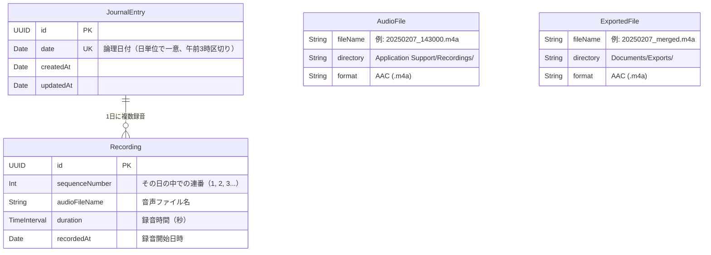

# iOS ジャーナリングアプリ 設計プロンプト

## アプリ概要

**コードネーム: MindEcho**

毎日の記録を音声で残せるジャーナリングアプリ。
音声入力は録音保存し、手軽に振り返りができる。

**本アプリの主な目的は、日々の記録を AI アプリに連携・共有し、分析してもらうためのフロントエンドとなること。**
ユーザーは本アプリで手軽に音声を記録し、
それらのデータを AI アプリに渡して振り返り・要約・傾向分析などを行う。
現時点では主に Google NotebookLM を連携先として想定しているが、
将来的には他の AI アプリ（ChatGPT、Gemini、Claude 等）への連携も視野に入れる。

## 技術スタック

| 項目 | 選定 |
|------|------|
| UI フレームワーク | SwiftUI |
| データ永続化 | SwiftData |
| 音声録音 | AVFoundation (AVAudioEngine + AVAudioFile) |
| 最小対応 OS | iOS 26.0 |
| データ保存先 | ローカルのみ |

## モジュール構成

マルチモジュール構成（ローカル Swift Package + App Target）で開発する。2つの SPM ライブラリパッケージ + 1つのアプリターゲットに分割する。

### 依存関係

```
MindEchoApp (App Target)
├── MindEchoCore   (local Swift Package)
└── MindEchoAudio  (local Swift Package)
```

### ディレクトリ配置

```
mind-echo/
├── Packages/
│   ├── MindEchoCore/
│   │   ├── Package.swift
│   │   ├── Sources/MindEchoCore/
│   │   └── Tests/MindEchoCoreTests/
│   └── MindEchoAudio/
│       ├── Package.swift
│       ├── Sources/MindEchoAudio/
│       └── Tests/MindEchoAudioTests/
└── MindEcho/
    └── MindEcho/             (App Target)
```

### モジュール一覧

| モジュール | 責務 | 主な型 | 依存先 |
|-----------|------|--------|--------|
| **MindEchoCore** | ドメインモデル, 日付ロジック（午前3時境界）, ファイルパス/命名規則, ディレクトリ管理, エクスポート protocol | `JournalEntry`, `Recording`, `ShareType`, `DateHelper`, `FilePathManager`, `Exporting` | Foundation, SwiftData |
| **MindEchoAudio** | 録音（一時停止/再開含む）, 再生（プログレス追跡含む）, AVAudioSession 管理, 複数音声ファイルの結合, TTS 日付アナウンス生成, 無音挿入 | `AudioRecorderService`, `AudioPlayerService`, `AudioMerger`, `TTSGenerator`, `AudioRecording`, `AudioPlaying` | AVFoundation |
| **MindEchoApp** | Views, ViewModels, ExportService 実装, Mocks, App lifecycle | `HomeView`, `HomeViewModel`, `ExportServiceImpl` 等 | MindEchoCore, MindEchoAudio |

### 設計方針

- **MindEchoAudio** は録音・再生・結合・TTS を1パッケージに統合する。全て AVFoundation を共通依存とし、音声処理という同一の関心領域に属する。AudioMerger 単独（2ファイル/約170行）や AudioService 単独では独立パッケージにするには薄すぎる
- **MindEchoAudio** は MindEchoCore に依存しない（コンパイル時に強制）。ファイルパス（URL）や文字列など基本型のみで動作し、ドメインモデルとの紐付けは ViewModel 層（App Target）が担う
- **ExportServiceImpl** は App Target に配置する。約60行の薄いブリッジで MindEchoCore と MindEchoAudio の両方に依存するため、独立パッケージ化すると依存チェーンが増えるだけで利点がない
- **MindEchoAudio** は AVFoundation のコールバックパターン（audio tap, delegate 等）を多用するため、Swift language mode を v5 に設定し strict concurrency チェックを緩和する

## データモデル

SwiftData の `@Model` マクロはすでに Observable に準拠しているため、
モデル層はそのまま SwiftUI のリアクティブ更新に対応する。
ViewModel 層では `@Observable` マクロ（Observation フレームワーク）を使用する。

**Observation チェーンと protocol の制約:**
`AudioRecorderService` は `@Observable` マクロを付与する。SwiftUI は `@Observable` な ViewModel のプロパティアクセスを追跡し、ViewModel が保持する `@Observable` オブジェクトのプロパティ（例: `audioRecorder.isRecording`）まで自動的に変更検知できる。これにより、HomeViewModel が `audioRecorder.isRecording` を参照すると、値の変化で View が自動再描画される。ただし Swift の `protocol` には `@Observable` マクロを付与できないため、`AudioRecording` プロトコル自体は Observation に準拠しない。具体型 `AudioRecorderService` が `@Observable` であることで追跡が成立する。テスト用モッククラスにも `@Observable` を付与し、同じ変更追跡の挙動を再現すること。

### ER図



- `JournalEntry` は SwiftData で管理される日単位のエンティティ
- `Recording` は SwiftData で管理される録音単位のエンティティ（`JournalEntry` に紐づく）
- `AudioFile` は物理ファイル（DB 外）を表す概念エンティティ
- `Recording.audioFileName` と `AudioFile.fileName` が対応する
- 1日1エントリに対して、録音は複数（0〜N）

### JournalEntry（日記エントリ）

1日1エントリ。
録音は1日に何度でも行え、それぞれ個別のファイル・個別の `Recording` として管理される。

**日付変更のしきい値は午前3:00（デバイスのローカルタイムゾーン基準）。**
0:00〜2:59 の操作は前日のエントリに記録される。
録音が日付境界を跨ぐ場合（例: 2:50〜3:10）、所属日は**録音開始時刻**で決定する。
例: 2月8日 午前1:30 の録音 → 2月7日のエントリに追加。
例: 2月8日 午前2:50 に開始し 3:10 に終了した録音 → 2月7日のエントリに追加（開始時刻が 3:00 より前のため）。
`DateHelper` は `TimeZone.current` を使用する。海外渡航等でタイムゾーンが変わった場合、その時点のローカルタイムで判定される。

**論理日付の正規化:** `JournalEntry.date` に格納する `Date` 値は、`DateHelper.logicalDate()` により論理日付の**正午 12:00（ローカルタイムゾーン）** に正規化する。正午を使用することで、タイムゾーン変更時の日付ズレ（深夜 0:00 基準だと UTC 変換で前後の日に跨ぐ問題）を回避する。クエリ時は正規化済みの `Date` 同士を直接比較する。

```swift
@Model
class JournalEntry {
    var id: UUID
    var date: Date                    // エントリの論理日付（DateHelper.logicalDate() で正規化済み、日単位で一意）
    var createdAt: Date
    var updatedAt: Date
    @Relationship(deleteRule: .cascade)
    var recordings: [Recording]       // その日の録音リスト（※ SwiftData は順序非保証。sortedRecordings を使用すること）

    /// 録音を sequenceNumber 昇順でソートして返す（SwiftData の @Relationship は順序を保証しないため）
    var sortedRecordings: [Recording] {
        recordings.sorted { $0.sequenceNumber < $1.sequenceNumber }
    }

    /// その日の合計録音時間（秒）
    var totalDuration: TimeInterval {
        recordings.reduce(0) { $0 + $1.duration }
    }
}

@Model
class Recording {
    var id: UUID
    var sequenceNumber: Int           // その日の中での連番（1, 2, 3...）
    var audioFileName: String         // 音声ファイル名
    var duration: TimeInterval        // 録音時間（秒）
    var recordedAt: Date              // 録音開始日時

    @Relationship(inverse: \JournalEntry.recordings)
    var entry: JournalEntry?
}

```

### ViewModel 層（@Observable）

```swift
import Observation
import SwiftData

@Observable
class HomeViewModel {
    // 録音状態 — isRecording / isPaused は audioRecorder から直接参照する（単一情報源）
    var recordingDuration: TimeInterval = 0  // 一時停止中を除いた実録音時間。isPaused 切り替え時に積算方式で更新する

    // 再生（録音直後の再生用）
    var playingRecordingId: UUID?     // 現在再生中の Recording の ID（nil = 再生なし）
    var isPlaying = false
    var playbackProgress: Double = 0  // 0.0〜1.0

    var todayEntry: JournalEntry?
    var errorMessage: String?

    private let modelContext: ModelContext
    private let audioRecorder: any AudioRecording
    private let audioPlayer: any AudioPlaying

    init(modelContext: ModelContext,
         audioRecorder: any AudioRecording,
         audioPlayer: any AudioPlaying = AudioPlayerService()) {
        self.modelContext = modelContext
        self.audioRecorder = audioRecorder
        self.audioPlayer = audioPlayer
    }

    func startRecording() { /* 新しい録音セッションを開始 */ }
    func pauseRecording() { /* 録音を一時停止（isPaused フラグ制御） */ }
    func resumeRecording() { /* 一時停止中の録音を再開 */ }
    func stopRecording() async { /* 録音を停止・確定 */ }
    func playRecording(_ recording: Recording) { /* 個別の録音を再生 */ }
    func pausePlayback() { /* 再生を一時停止 */ }
    func stopPlayback() { /* 再生を停止 */ }
    func fetchTodayEntry() { /* ... */ }
}

@Observable
class HistoryViewModel {
    var entries: [JournalEntry] = []
    private let modelContext: ModelContext

    init(modelContext: ModelContext) {
        self.modelContext = modelContext
    }

    func fetchEntries() { /* ... */ }
    func deleteEntry(_ entry: JournalEntry) { /* ... */ }
}

/// 共有タイプ
/// ExportService モジュールで定義し、App Target から参照する
enum ShareType {
    case audio              // 音声ファイル（全録音を結合した .m4a）
}

@Observable
class EntryDetailViewModel {
    var entry: JournalEntry
    var isEditing = false

    // 再生状態
    var playingRecordingId: UUID?     // 現在再生中の Recording の ID
    var isPlaying = false
    var playbackProgress: Double = 0
    private let modelContext: ModelContext
    private let audioPlayer: any AudioPlaying
    private let exportService: any Exporting

    init(entry: JournalEntry, modelContext: ModelContext,
         audioPlayer: any AudioPlaying = AudioPlayerService(),
         exportService: any Exporting = ExportService()) {
        self.entry = entry
        self.modelContext = modelContext
        self.audioPlayer = audioPlayer
        self.exportService = exportService
    }

    func playRecording(_ recording: Recording) { /* 個別の録音を再生 */ }
    func pausePlayback() { /* 再生を一時停止 */ }
    func stopPlayback() { /* 再生を停止 */ }
    func deleteRecording(_ recording: Recording) { /* 個別の録音を削除（ファイルも削除） */ }
    func exportForSharing() async throws -> URL {
        /* 全録音を連番順に結合した1つの .m4a を生成 */
    }
}
```

### View での利用パターン

```swift
struct HomeView: View {
    @State private var viewModel: HomeViewModel

    init(modelContext: ModelContext, audioRecorder: any AudioRecording) {
        _viewModel = State(initialValue: HomeViewModel(
            modelContext: modelContext,
            audioRecorder: audioRecorder
        ))
    }

    var body: some View {
        // @Observable により viewModel のプロパティ変更で自動再描画
        // @ObservedObject や @Published は不要
    }
}
```

### SwiftData クエリとの使い分け

- **単純な一覧取得**: View 内で `@Query` マクロを直接使用（将来のシンプルな一覧画面で活用可能）
- **複雑なロジックを伴う操作**: `@Observable` な ViewModel 経由で `ModelContext` を操作

本アプリでは以下の割り当てとする:
- **HomeView** → `HomeViewModel`（録音/再生の複雑な状態管理）
- **HistoryListView** → `HistoryViewModel`（検索・フィルタロジックを含むため ViewModel を使用）
- **EntryDetailView** → `EntryDetailViewModel`（再生/エクスポートの操作を含むため）

```swift
// ViewModel を使うパターン（本アプリの全画面で採用）
struct HomeView: View {
    @State private var viewModel: HomeViewModel
    // ...
}
```

## 画面構成

### 画面 1: ホーム画面（メイン入力画面）

アプリ起動時に表示される画面。今日の記録を素早く開始できることを最優先にする。

**レイアウト要素:**

- **日付表示（上部）** — 論理日付を「2025年2月7日（金）」のようなフォーマットで表示。午前3時より前は前日の日付を表示する
- **録音コントロール（中央・目立つ配置）** — 以下の操作ボタンを持つ:
  - **録音開始ボタン** — タップで新しい録音セッションを開始
  - **一時停止 / 再開ボタン** — 録音中に表示。タップで一時停止 ↔ 再開を切り替え（同一ファイル内）
  - **停止ボタン** — 録音中 or 一時停止中に表示。タップで録音を確定し、新しい `Recording` として保存
- **今日の録音リスト（下部）** — 今日既に録音がある場合、各録音を連番で一覧表示:
  - 連番（#1, #2, ...）
  - 録音時間
  - セルタップで再生 / 停止（個別再生）

**動作フロー（録音）:**

1. 録音開始ボタンをタップ → `AVAudioEngine` を起動し、input node tap から音声バッファを取得開始。バッファは `AVAudioFile` への書き出し（録音）に使用される
2. 一時停止ボタンをタップ → 一時停止フラグ（`isPaused`）を `true` に設定。tap コールバック内でフラグをチェックし、`AVAudioFile` への書き込みをスキップする。`AVAudioEngine` 自体は稼働し続ける（tap の remove/reinstall は不要）。一時停止中はバッファが破棄されるため、再開後の音声はシームレスに繋がる（無音区間は挿入されない）
3. 再開ボタンをタップ → `isPaused` を `false` に戻し、同一の `AVAudioFile` への追記を再開
4. 手順 2〜3 を何度でも繰り返し可能
5. 停止ボタンをタップ → `AVAudioEngine` を停止し、`AVAudioFile` をクローズして録音を確定
6. 新しい `Recording` が今日の録音リストに追加される
7. 再度録音開始ボタンを押すと → 新しいファイル・新しい `Recording` として別セッションで録音開始


### 画面 2: 履歴一覧画面

過去の日記エントリを日付ごとに一覧表示する画面。

**レイアウト要素:**

- **日付ごとのリスト** — 新しい日付が上に来る降順表示。各セルに以下を表示:
  - 日付（例: 2月6日 木）
  - 録音件数と合計時間の表示（例: 🎤 3件 / 12m30s）、録音なしの場合は非表示
**タップ時の遷移:**

- セルをタップ → エントリ詳細画面へ遷移

### 画面 3: エントリ詳細画面（履歴からの遷移先）

特定の日のエントリを閲覧・編集する画面。

**表示要素:**

- 日付ヘッダー
- 録音セクション — 各 Recording を連番順にリスト表示:
  - 連番と録音時刻（例: #1 14:30）
  - セルタップで再生 / 停止（個別再生）
  - 録音時間の表示
  - 個別の録音削除ボタン（スワイプ or ボタン）

## ナビゲーション構成

```
TabView {
    Tab("今日", systemImage: "mic.circle.fill") {
        HomeView()           // 画面 1
    }
    Tab("履歴", systemImage: "calendar") {
        HistoryListView()    // 画面 2
            → EntryDetailView()  // 画面 3（NavigationStack で push）
    }
}
```

## 必要なパーミッション（Info.plist）

| キー | 用途 |
|------|------|
| `NSMicrophoneUsageDescription` | 音声録音のためにマイクを使用します |

## ファイル管理方針

> **詳細は [file-management.md](./file-management.md) を参照。**
> ディレクトリ構成、ファイルアプリからのアクセス設定、ファイル命名規則、同期タイミング、フォーマットを定義している。

### AVAudioSession 管理方針

AudioService が `AVAudioSession` のカテゴリ・モード設定を一元管理する。

| 状態 | カテゴリ | モード | オプション |
|------|---------|--------|-----------|
| 録音中 | `.record` | `.default` | — |
| 再生中 | `.playback` | `.default` | — |
| アイドル時 | セッションを非アクティブ化 | — | — |

- 録音開始時にセッションを `.record` で activate し、停止時に deactivate する
- 再生開始時にセッションを `.playback` で activate し、停止/完了時に deactivate する

### バックグラウンド録音

録音中にアプリがバックグラウンドに移行した場合、**録音を継続する**。

- Xcode の Capabilities で **Background Modes → Audio** を有効にする
- `AVAudioSession` のカテゴリ設定により、バックグラウンドでも `AVAudioEngine` が稼働し続ける
- バックグラウンドでも録音（`AVAudioFile` への書き出し）は継続する。UI 更新のみがバックグラウンドでは反映されない
- フォアグラウンド復帰時に最新の状態を UI に即座に反映する

**Info.plist に追加:**

```xml
<key>UIBackgroundModes</key>
<array>
    <string>audio</string>
</array>
```

## 共有機能（NotebookLM 連携）

ジャーナルデータを NotebookLM にソースとして送り、AI による分析・振り返りを行う。

### 共有方式

NotebookLM には直接的な iOS URL Scheme やモバイル API は提供されていないため、
SwiftUI の `ShareLink` を使用し、
NotebookLM が受け取れる形式でデータをエクスポートする。

### 共有対象データと形式

| 共有タイプ | 形式 | 生成方法 | NotebookLM での扱い |
|-----------|------|---------|-------------------|
| 音声ファイル | `.m4a` | その日の全 Recording を連番順に結合して1つのファイルに生成 | 音声ソースとして読み込み（自動文字起こし） |

※ NotebookLM は m4a, mp3, wav, aac 等の音声ファイルを直接ソースとしてインポート可能。
音声をアップロードすると NotebookLM 側でも自動で文字起こしが行われる。

### 共有ボタンの配置

1. **エントリ詳細画面** — ナビゲーションバーに共有ボタン（`square.and.arrow.up`）

### 共有フロー

```
共有ボタンタップ
  ↓
エクスポートデータを生成:
  - 日付アナウンスを TTS で生成し、冒頭に挿入 + 全 Recording を連番順に結合 → 1つの .m4a
  ↓
生成したファイルを Documents/Exports/ にコピー（ファイルアプリから後からアクセス可能にする）
  ↓
iOS Share Sheet を表示
  ↓
ユーザーが共有先を選択:
  - 「ファイルに保存」→ Google Drive に保存 → NotebookLM からインポート
  - AirDrop → Mac/iPad → NotebookLM Web で直接アップロード
  - その他の共有先（メール、メッセージ等）
```

**エクスポート処理の詳細:**
- 音声ファイル:
  1. `AVSpeechSynthesizer` で日付アナウンス音声を生成（後述）
  2. 日付アナウンス + 全 Recording を `sequenceNumber` 順に結合 → `Application Support/Merged/` に一時生成
  3. `Documents/Exports/` にコピー
- 同じ日のエクスポートを複数回行った場合、`Documents/Exports/` 内の既存ファイルを上書きする（ファイル名が日付ベースのため同名になる）
- これにより、エクスポートしたファイルはファイルアプリからも後からアクセス可能

### 日付アナウンス音声（音声共有時の冒頭挿入）

NotebookLM 等の AI アプリはファイル名から日付を認識できないため、
共有する結合音声の冒頭に TTS で生成した日付アナウンスを挿入し、AI が日付を識別できるようにする。

**アナウンス内容（日本語）:**

```
これは{YYYY}年{M}月{D}日の録音です。
```

例: 「これは2025年2月7日の録音です。」

**生成方法:**

```swift
import AVFoundation

let synthesizer = AVSpeechSynthesizer()
let utterance = AVSpeechUtterance(string: "これは2025年2月7日の録音です。")
utterance.voice = AVSpeechSynthesisVoice(language: "ja-JP")
utterance.rate = AVSpeechUtteranceDefaultSpeechRate

// AVSpeechSynthesizer.write(_:toBufferCallback:) で音声データをファイルに書き出し
// 書き出した音声ファイルを結合音声の冒頭に挿入
```

**仕様:**
- `AVSpeechSynthesizer` を使用（オンデバイス処理、追加依存なし）
- 言語: 日本語（`ja-JP`）のみ
- 生成タイミング: 音声共有時（結合処理の一環として）
- 挿入位置: 結合音声の最初（日付アナウンス → Recording #1 → Recording #2 → ...）
- 日付アナウンスと最初の録音の間に短い無音（0.5〜1秒程度）を挿入して聞き取りやすくする

### AudioMerger の内部パイプライン

AudioMerger は複数の音声ソース（TTS 出力、録音ファイル、無音）を1つの AAC (.m4a) ファイルに結合する。
入力ソースのフォーマットが異なるため、すべてを一度 PCM にデコードしてから結合・AAC エンコードする方式を採用する。

```
入力:
  1. TTS 音声 — AVSpeechSynthesizer.write() → PCM バッファ
  2. 無音区間 — ゼロ埋め PCM バッファを生成（0.5〜1秒）
  3. 録音ファイル (.m4a) — AVAudioFile で読み込み → PCM バッファ

処理:
  全ソースを共通 PCM フォーマット（録音ファイルのサンプルレートに合わせる、mono, Float32）に統一
  → 順番に結合
  → AVAudioFile (commonFormat: PCM, settings: AAC) で .m4a に書き出し
```

- TTS 出力のサンプルレートが録音と異なる場合は `AVAudioConverter` で変換する
- 録音ファイルの読み込みは `AVAudioFile(forReading:)` で PCM バッファとして取得（内部で自動デコード）

### エクスポートフォーマット例

**音声ファイル** — ファイル名: `20250207_merged.m4a`
- 日付アナウンス → 無音（0.5〜1秒）→ Recording #1 → Recording #2 → ... の順で結合

※ ファイル名とヘッダーラベルは半角英数字のみ。本文は日本語を含んでよい。
※ ヘッダー内の曜日（`Fri` 等）は `Locale(identifier: "en_US_POSIX")` で固定生成する（デバイスロケールに依存しない）。

## 実装時の注意事項

- **音声スレッドの並行アクセス**: `AVAudioEngine` の tap コールバックはリアルタイム音声スレッドで実行される。`isPaused` フラグはメインスレッドから設定されるため、`AudioRecorderService` 内部で適切な同期が必要（`os_unfair_lock` や `Mutex` 等の軽量ロック推奨。音声スレッドでは `DispatchQueue` やアクターは使用不可）。`AVAudioFile.write(from:)` はリアルタイムスレッドでの呼び出しが許容されている API である
- **NotebookLM の制約**: ソース1つあたり 500,000語 / 200MB の上限がある

## テスト方針

- **非UIテスト**: Swift Testing フレームワークを使用してユニットテスト・ロジックテストを記述する
- **UIテスト**: メインシナリオを選定し XCTest で記述する（21テストケース）。詳細は [ui-test-design.md](./ui-test-design.md) を参照

各モジュール（MindEchoCore, AudioService, AudioMerger, ExportService）に対して、公開インターフェースのロジックを検証する非UIテストを作成する。
UIテストはユーザーの主要な操作フローに焦点を当て、5カテゴリでテストする。

### テスト可能性のための設計（DI 方針）

ハードウェア依存のモジュール（AudioService）をテスト可能にするため、各サービスは protocol を公開する。ViewModel は protocol 型でサービスを受け取り、テスト時にはモック実装を注入する。

```swift
// AudioService モジュールが公開する protocol
protocol AudioRecording {
    var isRecording: Bool { get }             // 録音中かどうか
    var isPaused: Bool { get }                // 録音一時停止中かどうか
    func startRecording(to url: URL) throws
    func pauseRecording()
    func resumeRecording()
    func stopRecording()
}

protocol AudioPlaying {
    var playbackProgress: Double { get }
    var onPlaybackFinished: (() -> Void)? { get set }  // 再生が自然終了した際のコールバック
    func play(url: URL) throws
    func pause()
    func stop()
}

// ViewModel は protocol 型で受け取る
@Observable
class HomeViewModel {
    init(modelContext: ModelContext,
         audioRecorder: any AudioRecording,
         audioPlayer: any AudioPlaying = AudioPlayerService()) { ... }
}

@Observable
class EntryDetailViewModel {
    init(entry: JournalEntry, modelContext: ModelContext,
         audioPlayer: any AudioPlaying = AudioPlayerService(),
         exportService: any Exporting = ExportService()) { ... }
}
```

- **MindEchoCore**: ハードウェア非依存。`DateHelper`, `FilePathManager` 等を直接テスト可能
- **AudioService**: `AudioRecording` / `AudioPlaying` protocol を公開。テスト時はモック実装を使用
- **AudioMerger**: ファイル入出力のみ。テスト用の音声ファイルを fixture として用意してテスト可能
- **ExportService**: `Exporting` protocol を公開。テスト用の一時ディレクトリでテスト可能

```swift
// ExportService モジュールが公開する protocol
protocol Exporting {
    func exportMergedAudio(entry: JournalEntry, to directory: URL) async throws -> URL
}
```

## 考慮事項・将来の拡張

- **iCloud 同期**: SwiftData の CloudKit 連携で将来対応可能
- **一括エクスポート**: 期間を指定して複数日分のジャーナルをまとめてエクスポート
- **NotebookLM Enterprise API 連携**: Google Cloud の NotebookLM Enterprise API が利用可能になれば、アプリから直接ノートブックにソースを追加する自動化が可能
- **ウィジェット**: ホーム画面から直接録音を開始するウィジェット
- **リマインダー通知**: 毎日の記録を促すローカル通知
- **音声文字起こし（Phase 2）**: SpeechAnalyzer / SpeechTranscriber（iOS 26 新API）を使用したリアルタイム文字起こし機能。詳細仕様は [transcription-phase2.md](./transcription-phase2.md) を参照
- **タグ / カテゴリ**: エントリにタグを付けて分類
- **気分トラッキング**: エントリに気分アイコンを付与
- **Foundation Models 連携**: iOS 26 のオンデバイス Foundation Models を使い、ジャーナルの要約やタイトル自動生成
