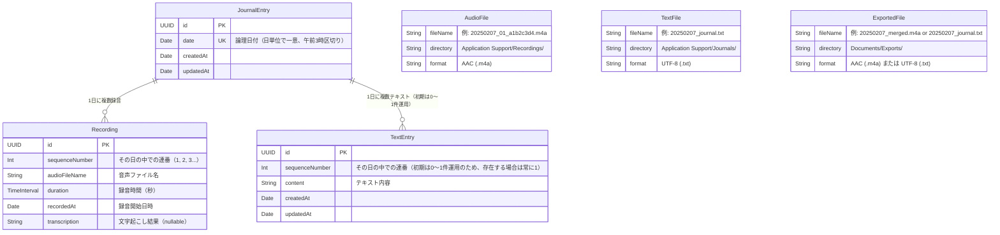

# iOS ジャーナリングアプリ 設計プロンプト

## アプリ概要

**コードネーム: MindEcho**

毎日の記録をテキストと音声で残せるジャーナリングアプリ。
音声入力は録音保存に加えて文字起こしも行い、手軽に振り返りができる。

**本アプリの主な目的は、日々の記録を AI アプリに連携・共有し、分析してもらうためのフロントエンドとなること。**
ユーザーは本アプリで手軽に音声やテキストを記録し、
それらのデータを AI アプリに渡して振り返り・要約・傾向分析などを行う。
現時点では主に Google NotebookLM を連携先として想定しているが、
将来的には他の AI アプリ（ChatGPT、Gemini、Claude 等）への連携も視野に入れる。

## 技術スタック

| 項目 | 選定 |
|------|------|
| UI フレームワーク | SwiftUI |
| データ永続化 | SwiftData |
| 音声録音 | AVFoundation (AVAudioEngine + AVAudioFile) |
| 音声文字起こし | SpeechAnalyzer / SpeechTranscriber（iOS 26 新API） |
| 波形表示 | OSS ライブラリを使用（後述） |
| 最小対応 OS | iOS 26.0（SpeechAnalyzer + SwiftData） |
| データ保存先 | ローカルのみ |

### 波形表示ライブラリ候補

必要に応じて以下のオープンソースライブラリから選定する。すべて SPM 対応・MIT ライセンス。

| ライブラリ | 用途 | 特徴 |
|-----------|------|------|
| [DSWaveformImage](https://github.com/dmrschmidt/DSWaveformImage) | 録音中のリアルタイム波形 + ファイル波形表示 | SwiftUI ネイティブ対応、ライブ録音用 `WaveformLiveView` とファイル用 `WaveformView` の両方あり。依存ゼロ、Stars 1,200+、活発にメンテナンス中 |
| [AudioKit/Waveform](https://github.com/AudioKit/Waveform) | ファイル波形表示 | GPU アクセラレーション（Metal）、SwiftUI 対応。AudioKit エコシステム |
| [FDWaveformView](https://github.com/fulldecent/FDWaveformView) | ファイル波形表示 + スクラブ | ズーム・スクロール・スクラブ操作対応。UIKit ベース |

**推奨: DSWaveformImage** — 録音中のリアルタイム波形（`WaveformLiveView`）と再生時のファイル波形（`WaveformView`）の両方をカバーでき、依存ライブラリもゼロ、SwiftUI にネイティブ対応している。

**波形データの供給方法:**
- **録音中（リアルタイム波形）**: `AudioRecorderService` が tap コールバック内で `AVAudioPCMBuffer` から RMS 振幅レベル（`Float`）を計算し、`currentAmplitude` プロパティとして公開する。View 層がタイマーまたは `@Observable` 経由で振幅値を取得し、`WaveformLiveView` にサンプルとして追加する
- **再生時（ファイル波形）**: `WaveformView` に音声ファイルの URL を渡すだけで、ライブラリが自動的にファイルから波形を生成する

## モジュール構成

マルチモジュール構成（Swift Package）で開発する。5つのライブラリモジュール + 1つのアプリターゲットに分割する。

### 依存関係

```
MindEchoApp (App Target)
├── MindEchoCore
├── AudioService
├── AudioMerger
├── Transcription
└── ExportService
    ├── MindEchoCore
    └── AudioMerger
```

### モジュール一覧

| モジュール | 責務 | 主な型 | 依存先 |
|-----------|------|--------|--------|
| **MindEchoCore** | ドメインモデル, 日付ロジック（午前3時境界）, ファイルパス/命名規則, ディレクトリ管理 | `JournalEntry`, `Recording`, `TextEntry`, `DateHelper`, `FilePathManager` | Foundation, SwiftData |
| **AudioService** | 録音（一時停止/再開含む）, 再生（プログレス追跡含む）, AVAudioSession 管理, 録音中の音声バッファ提供（文字起こし連携用）, 録音中の振幅レベル提供（波形表示用） | `AudioRecorderService`, `AudioPlayerService` | AVFoundation |
| **AudioMerger** | 複数音声ファイルの結合, TTS 日付アナウンス生成, 無音挿入 | `AudioMerger`, `TTSGenerator` | AVFoundation |
| **Transcription** | SpeechAnalyzer/SpeechTranscriber ラッパー, リアルタイム文字起こしストリーム | `TranscriptionService` | Speech |
| **ExportService** | エクスポート生成（テキスト/文字起こし/音声）, Documents/Exports/ へのコピー, Merged クリーンアップ（24時間） | `ExportService`, `FileCleanupManager` | MindEchoCore, AudioMerger |
| **MindEchoApp** | Views, ViewModels, App lifecycle | `HomeView`, `HomeViewModel` 等 | 全モジュール |

### 設計方針

- **AudioService** は録音と再生をまとめる。どちらも AVAudioSession の管理が必要でセッション設定を共有でき、単体では1〜2ファイル程度のためモジュールとしては薄すぎる。録音は `AVAudioEngine` の input node tap を唯一の音声ソースとし、tap コールバック内で `AVAudioFile` への書き出し（録音）と外部へのバッファ提供（文字起こし連携）を同時に行う。これにより `AVAudioRecorder` との二重キャプチャを回避する
- **録音中の再生は不可（全画面共通）。** 録音中はホーム画面・エントリ詳細画面を問わず、すべての再生ボタンを無効化（disable）する。録音と再生で異なる AVAudioSession 設定が必要になる複雑さを避け、シンプルな実装を優先する。これを担保するため、`AudioRecorderService` は App 層で単一インスタンスとして生成し、録音状態を参照する全 ViewModel に共有注入する
- **AudioMerger** は独立モジュールとする。録音・再生（リアルタイム操作）とマージ（バッチ処理）は性質が異なり、入出力が `[URL] → URL` と明確で他モジュールへの依存がない
- **AudioService, AudioMerger, Transcription** は MindEchoCore に依存しない。ファイルパス（URL）や文字列など基本型のみで動作し、ドメインモデルとの紐付けは ViewModel 層（App Target）が担う
- **ExportService** は MindEchoCore に依存する。テキストエクスポートのフォーマット生成にドメイン構造の知識が必要なため

## データモデル

SwiftData の `@Model` マクロはすでに Observable に準拠しているため、
モデル層はそのまま SwiftUI のリアクティブ更新に対応する。
ViewModel 層では `@Observable` マクロ（Observation フレームワーク）を使用する。

**Observation チェーンと protocol の制約:**
`AudioRecorderService` は `@Observable` マクロを付与する。SwiftUI は `@Observable` な ViewModel のプロパティアクセスを追跡し、ViewModel が保持する `@Observable` オブジェクトのプロパティ（例: `audioRecorder.isRecording`）まで自動的に変更検知できる。これにより、HomeViewModel や EntryDetailViewModel が `audioRecorder.isRecording` を参照すると、値の変化で View が自動再描画される。ただし Swift の `protocol` には `@Observable` マクロを付与できないため、`AudioRecording` プロトコル自体は Observation に準拠しない。具体型 `AudioRecorderService` が `@Observable` であることで追跡が成立する。テスト用モッククラスにも `@Observable` を付与し、同じ変更追跡の挙動を再現すること。

### ER図



- `JournalEntry` は SwiftData で管理される日単位のエンティティ
- `Recording` は SwiftData で管理される録音単位のエンティティ（`JournalEntry` に紐づく）
- `TextEntry` は SwiftData で管理されるテキスト単位のエンティティ（`JournalEntry` に紐づく）
- `AudioFile` / `TextFile` は物理ファイル（DB 外）を表す概念エンティティ
- `Recording.audioFileName` と `AudioFile.fileName` が対応する
- `TextEntry.content` の内容が `TextFile` に同期書き出しされる
- 1日1エントリに対して、録音は複数（0〜N）、テキストも複数（0〜N、**初期は0〜1件で運用**）

### JournalEntry（日記エントリ）

1日1エントリ。
録音は1日に何度でも行え、それぞれ個別のファイル・個別の `Recording` として管理される。
テキストも `TextEntry` として独立管理する。**初期バージョンでは1日1テキストの運用だが、将来的に複数テキスト対応を可能にするため、最初から1対多のリレーションで設計する。**

**日付変更のしきい値は午前3:00（デバイスのローカルタイムゾーン基準）。**
0:00〜2:59 の操作は前日のエントリに記録される。
録音が日付境界を跨ぐ場合（例: 2:50〜3:10）、所属日は**録音開始時刻**で決定する。
例: 2月8日 午前1:30 の録音 → 2月7日のエントリに追加。
例: 2月8日 午前2:50 に開始し 3:10 に終了した録音 → 2月7日のエントリに追加（開始時刻が 3:00 より前のため）。
`DateHelper` は `TimeZone.current` を使用する。海外渡航等でタイムゾーンが変わった場合、その時点のローカルタイムで判定される。

**論理日付の正規化:** `JournalEntry.date` に格納する `Date` 値は、`DateHelper.logicalDate()` により論理日付の**正午 12:00（ローカルタイムゾーン）** に正規化する。正午を使用することで、タイムゾーン変更時の日付ズレ（深夜 0:00 基準だと UTC 変換で前後の日に跨ぐ問題）を回避する。クエリ時は正規化済みの `Date` 同士を直接比較する。

```swift
@Model
class JournalEntry {
    var id: UUID
    var date: Date                    // エントリの論理日付（DateHelper.logicalDate() で正規化済み、日単位で一意）
    var createdAt: Date
    var updatedAt: Date
    @Relationship(deleteRule: .cascade)
    var recordings: [Recording]       // その日の録音リスト（※ SwiftData は順序非保証。sortedRecordings を使用すること）
    @Relationship(deleteRule: .cascade)
    var textEntries: [TextEntry]      // その日のテキストリスト（※ SwiftData は順序非保証。sortedTextEntries を使用すること）

    /// 録音を sequenceNumber 昇順でソートして返す（SwiftData の @Relationship は順序を保証しないため）
    var sortedRecordings: [Recording] {
        recordings.sorted { $0.sequenceNumber < $1.sequenceNumber }
    }

    /// テキストを sequenceNumber 昇順でソートして返す
    var sortedTextEntries: [TextEntry] {
        textEntries.sorted { $0.sequenceNumber < $1.sequenceNumber }
    }

    /// その日の合計録音時間（秒）
    var totalDuration: TimeInterval {
        recordings.reduce(0) { $0 + $1.duration }
    }
}

@Model
class Recording {
    var id: UUID
    var sequenceNumber: Int           // その日の中での連番（1, 2, 3...）
    var audioFileName: String         // 音声ファイル名
    var duration: TimeInterval        // 録音時間（秒）
    var recordedAt: Date              // 録音開始日時
    var transcription: String?        // 文字起こし結果（リアルタイム文字起こしの確定テキスト）

    @Relationship(inverse: \JournalEntry.recordings)
    var entry: JournalEntry?
}

@Model
class TextEntry {
    var id: UUID
    var sequenceNumber: Int           // その日の中での連番（初期は0〜1件運用のため、存在する場合は常に1）
    var content: String               // テキスト内容
    var createdAt: Date
    var updatedAt: Date

    @Relationship(inverse: \JournalEntry.textEntries)
    var entry: JournalEntry?
}
```

### ViewModel 層（@Observable）

```swift
import Observation
import SwiftData

@Observable
class HomeViewModel {
    // 録音状態 — isRecording / isPaused / currentAmplitude は audioRecorder から直接参照する（単一情報源）
    var recordingDuration: TimeInterval = 0  // 一時停止中を除いた実録音時間。isPaused 切り替え時に積算方式で更新する

    // リアルタイム文字起こし
    var liveTranscription = ""        // 録音中のリアルタイム文字起こしテキスト（暫定）
    var isTranscribing = false        // 文字起こし処理中

    // 再生（録音直後の再生用）— 録音中は再生不可（ボタンを disable にする）
    var playingRecordingId: UUID?     // 現在再生中の Recording の ID（nil = 再生なし）
    var isPlaying = false
    var playbackProgress: Double = 0  // 0.0〜1.0
    /// 再生ボタンの有効/無効判定（audioRecorder の状態を直接参照）
    var canPlayback: Bool { !audioRecorder.isRecording }

    var todayEntry: JournalEntry?
    var errorMessage: String?

    private let modelContext: ModelContext
    private let audioRecorder: any AudioRecording
    private let audioPlayer: any AudioPlaying
    private let transcriptionService: any Transcribing

    init(modelContext: ModelContext,
         audioRecorder: any AudioRecording,              // App 層から共有インスタンスを注入
         audioPlayer: any AudioPlaying = AudioPlayerService(),
         transcriptionService: any Transcribing = TranscriptionService()) {
        self.modelContext = modelContext
        self.audioRecorder = audioRecorder
        self.audioPlayer = audioPlayer
        self.transcriptionService = transcriptionService
    }

    func startRecording() { /* 新しい録音セッションを開始。リアルタイム文字起こしも同時開始 */ }
    func pauseRecording() { /* 録音を一時停止（isPaused フラグ制御） */ }
    func resumeRecording() { /* 一時停止中の録音を再開 */ }
    func stopRecording() async { /* 録音を停止・確定。確定テキストを Recording に保存 */ }
    func playRecording(_ recording: Recording) { /* 個別の録音を再生（isRecording 中は呼び出し不可） */ }
    func pausePlayback() { /* 再生を一時停止 */ }
    func stopPlayback() { /* 再生を停止 */ }
    func saveText(_ text: String) { /* TextEntry を作成 or 更新。初期は1件のみ */ }
    func fetchTodayEntry() { /* ... */ }
}

@Observable
class HistoryViewModel {
    var entries: [JournalEntry] = []
    var searchText = ""
    var filteredEntries: [JournalEntry] {
        guard !searchText.isEmpty else { return entries }
        return entries.filter { /* TextEntry.content・Recording.transcription をフィルタ */ }
    }

    private let modelContext: ModelContext

    init(modelContext: ModelContext) {
        self.modelContext = modelContext
    }

    func fetchEntries() { /* ... */ }
    func deleteEntry(_ entry: JournalEntry) { /* ... */ }
}

/// 共有タイプの排他選択（1つのみ選択可能）
/// ExportService モジュールで定義し、App Target から参照する
enum ShareType {
    case textJournal        // テキスト日記（全 TextEntry を結合した .txt）
    case transcription      // 文字起こしテキスト（全 Recording の transcription を結合した .txt）
    case audio              // 音声ファイル（全録音を結合した .m4a）
}

@Observable
class EntryDetailViewModel {
    var entry: JournalEntry
    var isEditing = false

    // 再生状態
    var playingRecordingId: UUID?     // 現在再生中の Recording の ID
    var isPlaying = false
    var playbackProgress: Double = 0
    /// 再生ボタンの有効/無効判定（録音中は全画面で再生不可）
    var canPlayback: Bool { !audioRecorder.isRecording }

    private let modelContext: ModelContext
    private let audioRecorder: any AudioRecording  // 録音状態の参照用（App 層から共有インスタンスを注入）
    private let audioPlayer: any AudioPlaying
    private let exportService: any Exporting

    init(entry: JournalEntry, modelContext: ModelContext,
         audioRecorder: any AudioRecording,
         audioPlayer: any AudioPlaying = AudioPlayerService(),
         exportService: any Exporting = ExportService()) {
        self.entry = entry
        self.modelContext = modelContext
        self.audioRecorder = audioRecorder
        self.audioPlayer = audioPlayer
        self.exportService = exportService
    }

    func playRecording(_ recording: Recording) { /* 個別の録音を再生（audioRecorder.isRecording 中は呼び出し不可） */ }
    func pausePlayback() { /* 再生を一時停止 */ }
    func stopPlayback() { /* 再生を停止 */ }
    func deleteRecording(_ recording: Recording) { /* 個別の録音を削除（ファイルも削除） */ }
    func exportForSharing(type: ShareType) async throws -> URL {
        /* 排他選択（1つのみ）で生成したファイルの URL を返す:
           .audio: 全録音を連番順に結合した1つの .m4a を生成
           .transcription: 全録音の文字起こしを結合した .txt を生成
           .textJournal: 全 TextEntry を連番順に結合した .txt を生成 */
    }
}
```

### View での利用パターン

```swift
struct HomeView: View {
    @State private var viewModel: HomeViewModel

    init(modelContext: ModelContext, audioRecorder: any AudioRecording) {
        _viewModel = State(initialValue: HomeViewModel(
            modelContext: modelContext,
            audioRecorder: audioRecorder
        ))
    }

    var body: some View {
        // @Observable により viewModel のプロパティ変更で自動再描画
        // @ObservedObject や @Published は不要
    }
}
```

### SwiftData クエリとの使い分け

- **単純な一覧取得**: View 内で `@Query` マクロを直接使用（将来のシンプルな一覧画面で活用可能）
- **複雑なロジックを伴う操作**: `@Observable` な ViewModel 経由で `ModelContext` を操作

本アプリでは以下の割り当てとする:
- **HomeView** → `HomeViewModel`（録音/再生/文字起こしの複雑な状態管理）
- **HistoryListView** → `HistoryViewModel`（検索・フィルタロジックを含むため ViewModel を使用）
- **EntryDetailView** → `EntryDetailViewModel`（再生/編集/エクスポートの操作を含むため）

```swift
// ViewModel を使うパターン（本アプリの全画面で採用）
struct HomeView: View {
    @State private var viewModel: HomeViewModel
    // ...
}
```

## 画面構成

### 画面 1: ホーム画面（メイン入力画面）

アプリ起動時に表示される画面。今日の記録を素早く開始できることを最優先にする。

**レイアウト要素:**

- **日付表示（上部）** — 論理日付を「2025年2月7日（金）」のようなフォーマットで表示。午前3時より前は前日の日付を表示する
- **録音コントロール（中央・目立つ配置）** — 以下の操作ボタンを持つ:
  - **録音開始ボタン** — タップで新しい録音セッションを開始。リアルタイム文字起こしも同時に開始
  - **一時停止 / 再開ボタン** — 録音中に表示。タップで一時停止 ↔ 再開を切り替え（同一ファイル内）
  - **停止ボタン** — 録音中 or 一時停止中に表示。タップで録音を確定し、新しい `Recording` として保存
- **リアルタイム文字起こし表示（録音中）** — 録音中に画面下部などにリアルタイムで文字起こしテキストを表示。暫定テキスト（volatile）と確定テキスト（finalized）を視覚的に区別する
- **録音中の波形表示** — リアルタイム波形を表示（DSWaveformImage の `WaveformLiveView` 等を使用）
- **テキスト入力ボタン（録音ボタンの近く）** — タップでテキスト入力モードに遷移 or シートを表示。既にテキストがある場合は編集モードで開く
- **今日の録音リスト（下部）** — 今日既に録音がある場合、各録音を連番で一覧表示:
  - 連番（#1, #2, ...）
  - 録音時間
  - 再生 / 一時停止ボタン（個別再生）— **録音中は無効化（disable）**
  - 文字起こしテキストの先頭部分（プレビュー）

**動作フロー（録音）:**

1. 録音開始ボタンをタップ → `AVAudioEngine` を起動し、input node tap から音声バッファを取得開始。バッファは `AVAudioFile` への書き出し（録音）と `SpeechAnalyzer.analyze(buffer:)` への供給（文字起こし）の両方に使用される
2. リアルタイム文字起こしテキストが逐次表示される
3. 一時停止ボタンをタップ → 一時停止フラグ（`isPaused`）を `true` に設定。tap コールバック内でフラグをチェックし、`AVAudioFile` への書き込みと `SpeechAnalyzer` へのバッファ供給をスキップする。`AVAudioEngine` 自体は稼働し続ける（tap の remove/reinstall は不要）。一時停止中はバッファが破棄されるため、再開後の音声はシームレスに繋がる（無音区間は挿入されない）
4. 再開ボタンをタップ → `isPaused` を `false` に戻し、同一の `AVAudioFile` への追記を再開。`SpeechAnalyzer` は中断前のコンテキストを保持しており、バッファ供給再開後もそのまま文字起こしを継続する
5. 手順 3〜4 を何度でも繰り返し可能
6. 停止ボタンをタップ → `AVAudioEngine` を停止し、`AVAudioFile` をクローズして録音を確定
7. 文字起こしの確定テキストを `Recording.transcription` に保存
8. 新しい `Recording` が今日の録音リストに追加される
9. 再度録音開始ボタンを押すと → 新しいファイル・新しい `Recording` として別セッションで録音開始


**動作フロー（テキスト）:**

1. テキスト入力ボタンをタップ → テキストエディタを表示
2. 保存 → `TextEntry` を作成 or 更新し、`Journals/{date}_journal.txt` も同期更新
3. 初期バージョンでは1日1件の `TextEntry` のみ。既にテキストがある場合は既存の `TextEntry` を編集する

### 画面 2: 履歴一覧画面

過去の日記エントリを日付ごとに一覧表示する画面。

**レイアウト要素:**

- **日付ごとのリスト** — 新しい日付が上に来る降順表示。各セルに以下を表示:
  - 日付（例: 2月6日 木）
  - テキストの先頭数行（プレビュー）
  - 録音件数と合計時間の表示（例: 🎤 3件 / 12m30s）、録音なしの場合は非表示
- **検索バー（上部）** — テキスト内容・文字起こし内容をフルテキスト検索

**タップ時の遷移:**

- セルをタップ → エントリ詳細画面へ遷移

### 画面 3: エントリ詳細画面（履歴からの遷移先）

特定の日のエントリを閲覧・編集する画面。

**表示要素:**

- 日付ヘッダー
- テキスト内容（編集可能）
- 録音セクション（録音がある場合）— 各 Recording を連番順にリスト表示:
  - 連番と録音時刻（例: #1 14:30）
  - 再生ボタン / 一時停止ボタン（個別再生）— **録音中は無効化（disable）**（HomeView と同様、共有 `AudioRecorderService` の `isRecording` を参照）
  - 録音時間の表示
  - 波形表示（DSWaveformImage の `WaveformView` でファイル波形を表示）
  - 文字起こしテキスト（展開/折りたたみ可能）
  - 個別の録音削除ボタン（スワイプ or ボタン）

## ナビゲーション構成

```
TabView {
    Tab("今日", systemImage: "mic.circle.fill") {
        HomeView()           // 画面 1
    }
    Tab("履歴", systemImage: "calendar") {
        HistoryListView()    // 画面 2
            → EntryDetailView()  // 画面 3（NavigationStack で push）
    }
}
```

## 必要なパーミッション（Info.plist）

| キー | 用途 |
|------|------|
| `NSMicrophoneUsageDescription` | 音声録音のためにマイクを使用します |
| `NSSpeechRecognitionUsageDescription` | 録音した音声をテキストに変換するために使用します |

※ iOS 26 の SpeechAnalyzer ではユーザーが設定で言語を追加する必要がなくなった。
言語モデルは自動的にダウンロード・管理される。

## ファイル管理方針

> **詳細は [file-management.md](./file-management.md) を参照。**
> ディレクトリ構成、ファイルアプリからのアクセス設定、ファイル命名規則、同期タイミング、フォーマットを定義している。

### AVAudioSession 管理方針

AudioService が `AVAudioSession` のカテゴリ・モード設定を一元管理する。

| 状態 | カテゴリ | モード | オプション |
|------|---------|--------|-----------|
| 録音中 | `.record` | `.default` | — |
| 再生中 | `.playback` | `.default` | — |
| アイドル時 | セッションを非アクティブ化 | — | — |

- 録音開始時にセッションを `.record` で activate し、停止時に deactivate する
- 再生開始時にセッションを `.playback` で activate し、停止/完了時に deactivate する
- **録音中は再生不可**（セッションカテゴリの切り替えを避けるため）。録音中は再生ボタンを disable にする

### バックグラウンド録音

録音中にアプリがバックグラウンドに移行した場合、**録音を継続する**。

- Xcode の Capabilities で **Background Modes → Audio** を有効にする
- `AVAudioSession` のカテゴリ設定により、バックグラウンドでも `AVAudioEngine` が稼働し続ける
- バックグラウンドでも録音（`AVAudioFile` への書き出し）、`SpeechAnalyzer` へのバッファ供給、文字起こし結果の蓄積はすべて継続する。UI 更新（波形表示・文字起こしテキスト表示）のみがバックグラウンドでは反映されない
- フォアグラウンド復帰時に蓄積済みの `finalizedText` と `liveTranscription` を UI に即座に反映する

**Info.plist に追加:**

```xml
<key>UIBackgroundModes</key>
<array>
    <string>audio</string>
</array>
```

## 文字起こしの仕様（SpeechAnalyzer — iOS 26 新API）

iOS 26 で導入された `SpeechAnalyzer` + `SpeechTranscriber` を使用する。
従来の `SFSpeechRecognizer` に比べ、長時間音声への対応、高速処理、完全オフライン動作が大幅に改善されている。

**本アプリではリアルタイム文字起こしを採用する。** 録音中にマイク入力をストリーミングで `SpeechTranscriber` に渡し、逐次テキストを画面に表示する。録音停止時に確定テキストを `Recording.transcription` に保存する。

### 音声パイプライン構成

録音と文字起こしは `AVAudioEngine` の input node tap を唯一の音声ソースとして共有する。
`AVAudioRecorder` は使用しない（二重キャプチャの回避）。

```
AVAudioEngine (input node tap) — PCM バッファ
  ├── AVAudioFile に書き出し → .m4a ファイル（録音、AAC エンコード）
  ├── SpeechAnalyzer.analyze(buffer:) → SpeechTranscriber（文字起こし）
  └── 振幅レベル計算 → WaveformLiveView（リアルタイム波形表示）
```

**フォーマット変換:**
- `AVAudioEngine` の input node tap は **PCM（Linear PCM）バッファ** を提供する（デバイスネイティブフォーマット、通常 48kHz Float32）
- `AVAudioFile` は初期化時に **出力フォーマット（AAC）** と **処理フォーマット（PCM）** を分けて指定できる。tap から受け取った PCM バッファを `write(from:)` すると、内部で自動的に AAC エンコードされて `.m4a` ファイルに書き出される
- `SpeechAnalyzer` には tap から受け取った PCM バッファをそのまま渡す。`SpeechAnalyzer` が期待するフォーマットと tap のフォーマットが異なる場合は `AVAudioConverter` で変換する（実装時に要確認）

- **AudioService** が `AVAudioEngine` を所有し、tap コールバック内で `AVAudioFile` への書き出しと、外部から注入されたクロージャへのバッファ転送を行う。**tap コールバック内で渡される `AVAudioPCMBuffer` はオーディオエンジンが内部的に再利用するため、コールバック終了後にデータが上書きされる可能性がある。** そのため、外部にバッファを転送する際は **事前確保済みバッファプール** からバッファを取得し、サンプルデータをコピーしてから渡す（tap コールバック内での `AVAudioPCMBuffer` の新規生成（`malloc`）を回避する）。加えて、バッファから振幅レベル（RMS/ピーク値）を計算し、波形表示用に公開する
- **リアルタイムスレッド安全性**: tap コールバックはリアルタイムオーディオスレッドで実行されるため、コールバック内ではメモリ確保・ロック取得・Objective-C メッセージングなどのブロッキング操作を行わない。バッファのコピーには **エンジン起動前に事前確保したバッファプール**（固定数の `AVAudioPCMBuffer`、例: 8個）を使用し、アトミックインデックスでロックフリーに取得する（`memcpy` 相当のコピーのみで `malloc` は発生しない）。コピー後の外部コールバック呼び出しは **専用のシリアルキュー**（`DispatchQueue(label: "audio.processing")`）にディスパッチする。処理キューでの消費完了後にバッファをプールに返却する。メインキューには直接ディスパッチしない（48kHz / 1024フレーム ≈ 毎秒47回の頻度になり UI スレッドを圧迫するため）。振幅レベルの UI 更新のみ、間引き（10〜15Hz 程度）した上でメインキューに転送する
- **ViewModel 層（App Target）** が AudioService のバッファコールバックを TranscriptionService に接続する。これにより AudioService と Transcription の直接依存を避ける

### 基本実装パターン（録音 + リアルタイム文字起こし）

```swift
import Speech
import AVFoundation

// --- AudioService 側（録音） ---
// AVAudioEngine の input node tap でバッファを取得し、
// 1. AVAudioFile に書き出し（録音・AAC エンコード）
// 2. onBuffer コールバックで外部にバッファを提供（文字起こし連携）
// 3. 振幅レベル計算（波形表示用）

let engine = AVAudioEngine()
let inputNode = engine.inputNode
let recordingFormat = inputNode.outputFormat(forBus: 0)  // PCM（デバイスネイティブ）

// AAC (.m4a) 出力用の設定
let outputSettings: [String: Any] = [
    AVFormatIDKey: kAudioFormatMPEG4AAC,
    AVSampleRateKey: recordingFormat.sampleRate,
    AVNumberOfChannelsKey: recordingFormat.channelCount,
    AVEncoderBitRateKey: 128_000
]

// commonFormat で入力の PCM フォーマットを指定し、settings で出力の AAC フォーマットを指定
// AVAudioFile が内部で PCM → AAC の変換を自動的に行う
let audioFile = try AVAudioFile(
    forWriting: fileURL,
    settings: outputSettings,
    commonFormat: .pcmFormatFloat32,
    interleaved: false
)

var isPaused = false  // 一時停止フラグ（後述）

// --- 事前確保バッファプール ---
// エンジン起動前に固定数の AVAudioPCMBuffer を確保しておき、
// tap コールバック内での malloc を回避する（リアルタイムスレッド安全性）
let poolSize = 8
let bufferPool: [AVAudioPCMBuffer] = (0..<poolSize).compactMap { _ in
    guard let buf = AVAudioPCMBuffer(
        pcmFormat: recordingFormat,
        frameCapacity: 1024
    ) else { return nil }
    return buf
}
// アトミックインデックスでロックフリーに取得（OS のロックを使わない）
let poolIndex = OSAtomicInt64(0)

inputNode.installTap(onBus: 0, bufferSize: 1024, format: recordingFormat) { buffer, time in
    guard !isPaused else { return }  // 一時停止中はスキップ
    // 録音: ファイルに書き出し（PCM → AAC 自動変換）
    try? audioFile.write(from: buffer)

    // 事前確保済みプールからバッファを取得し、サンプルデータをコピーする
    // （tap コールバックで渡される AVAudioPCMBuffer はコールバック終了後に
    //   オーディオエンジンが再利用するため、そのまま外部に渡すとデータが破損する。
    //   プールから取得することで malloc を回避し、memcpy 相当のコピーのみ行う）
    let idx = Int(OSAtomicIncrement64(&poolIndex) % Int64(poolSize))
    let pooledBuffer = bufferPool[idx]
    pooledBuffer.frameLength = buffer.frameLength
    if let src = buffer.floatChannelData,
       let dst = pooledBuffer.floatChannelData {
        let chCount = Int(buffer.format.channelCount)
        let frames = Int(buffer.frameLength)
        for ch in 0..<chCount {
            dst[ch].update(from: src[ch], count: frames)
        }
    }

    // 専用シリアルキューにディスパッチしてから外部コールバックを呼ぶ
    // （リアルタイムオーディオスレッドで任意のクロージャを実行すると、
    //   メモリ確保やロック取得が発生しグリッチの原因になる）
    // ⚠️ メインキューではなく専用キューを使用する。48kHz / 1024フレーム ≈ 毎秒47回の
    //   ディスパッチが発生するため、メインキューに直接流すと UI スレッドを圧迫する。
    processingQueue.async {
        onBuffer?(pooledBuffer)
        // pooledBuffer は processingQueue での消費完了後、プールに自動的に返却される
        // （次の tap コールバックで同じインデックスが巡ってくるまで再利用されない）
    }

    // 振幅レベルの UI 更新は間引いてメインキューに転送（10〜15Hz 程度）
    let now = CACurrentMediaTime()
    if now - lastAmplitudeUpdate >= amplitudeUpdateInterval {
        lastAmplitudeUpdate = now
        let rms = Self.calculateRMS(buffer)
        DispatchQueue.main.async {
            self.currentAmplitude = rms
        }
    }
}

// --- 専用シリアルキュー（バッファ転送用） ---
private let processingQueue = DispatchQueue(label: "com.mindecho.audio.processing")

// --- 振幅更新の間引き ---
private var lastAmplitudeUpdate: Double = 0
private let amplitudeUpdateInterval: Double = 1.0 / 15  // ~15Hz

engine.prepare()
try engine.start()

// --- Transcription 側（文字起こし） ---
let locale = Locale(identifier: "ja_JP")
let transcriber = SpeechTranscriber(locale: locale, preset: .transcription)
let analyzer = SpeechAnalyzer(modules: [transcriber])

// AudioService の onBuffer コールバック経由でコピー済みバッファを受け取り、
// SpeechAnalyzer に渡す（バッファは AudioService 側でコピー＆ディスパッチ済みのため、
// ここでは安全に使用できる）
audioRecorderService.onBuffer = { copiedBuffer in
    analyzer.analyze(copiedBuffer)
}

// 結果の取得（AsyncSequence）
// SpeechTranscriber は文の区切りごとに isFinal な結果を返すため、
// 録音セッション中に複数の確定結果が得られる。これらを連結して最終的な transcription を構築する。
var finalizedText = ""  // 確定済みテキストの蓄積

Task {
    for await result in transcriber.results {
        // AttributedString → String 変換（タイミングデータ等は不要なためプレーンテキストのみ保持）
        let text = String(result.text.characters)
        if result.isFinal {
            // 確定テキストを蓄積（区切りごとに追記）
            finalizedText += text
        } else {
            // 暫定テキスト → UI にリアルタイム表示（確定済み + 暫定を結合して表示）
            liveTranscription = finalizedText + text
        }
    }
    // 録音停止後、蓄積した finalizedText を Recording.transcription に保存
}
```

### 主要コンポーネント

| クラス | 役割 |
|--------|------|
| `SpeechAnalyzer` | 分析セッションを管理。モジュールを追加して使用 |
| `SpeechTranscriber` | 音声→テキスト変換モジュール |
| `SpeechDetector` | 音声区間の検出（VAD）。フルの文字起こしなしで音声有無を判定 |

### プリセット

- `.transcription` — リアルタイム文字起こしに使用。本アプリのメインプリセット
- `.offlineTranscription` — オフライン専用。録音済みファイルの一括処理（将来のリトライ処理等で使用可能）

### 仕様詳細

- 完全オンデバイス処理（ネットワーク不要、プライバシー確保）
- 言語モデルの自動ダウンロード・管理（ユーザーが設定で言語追加する必要なし）
- `ja_JP` はサポート対象ロケールに含まれる
- 結果は `AttributedString` で返却され、タイミングデータも含まれる。保存時は `String(result.text.characters)` でプレーンテキストに変換して `Recording.transcription` に格納する
- volatile（暫定）と finalized（確定）の2段階で結果がストリーム配信される
- **録音中にリアルタイムで実行** — 暫定テキストを画面に逐次表示し、確定テキストを `Recording.transcription` に保存
- **一時停止中の挙動**: 録音が一時停止されると `SpeechAnalyzer` へのバッファ供給が中断される。`SpeechAnalyzer` は内部コンテキストを保持しているため、再開後にバッファ供給が再開されればそのまま文字起こしを継続する。一時停止中にそれまでの暫定テキストが確定テキストに遷移する可能性がある
- 文字起こし失敗時はエラーメッセージを表示し、リトライボタンを提供。リトライは保存済み音声ファイルに対して `.offlineTranscription` プリセットで再処理を行う

### デバイスサポートの確認

本アプリの最小対応 OS は iOS 26.0 であり、iOS 26 対応デバイスはすべて Neural Engine（A12 Bionic 以降）を搭載しているため、`SpeechTranscriber` は全対象デバイスで利用可能である。
そのため `DictationTranscriber` 等へのフォールバックは設けず、`supportsDevice()` は防御的チェックとしてのみ使用し、万一 `false` を返した場合はユーザーにエラーメッセージを表示する。

```swift
guard SpeechTranscriber.supportsDevice() else {
    // 到達しない想定だが、防御的にエラーを表示
    throw TranscriptionError.deviceNotSupported
}
// SpeechTranscriber を使用
let transcriber = SpeechTranscriber(locale: locale, preset: .transcription)
```

## 共有機能（NotebookLM 連携）

ジャーナルデータを NotebookLM にソースとして送り、AI による分析・振り返りを行う。

### 共有方式

NotebookLM には直接的な iOS URL Scheme やモバイル API は提供されていないため、
SwiftUI の `ShareLink` を使用し、
NotebookLM が受け取れる形式でデータをエクスポートする。

### 共有対象データと形式

| 共有タイプ | 形式 | 生成方法 | NotebookLM での扱い |
|-----------|------|---------|-------------------|
| テキスト日記 | `.txt` ファイル | 全 TextEntry の `content` を連番順に結合して生成 | テキストソースとして読み込み |
| 文字起こしテキスト | `.txt` ファイル | 全 Recording の `transcription` を連番順に結合して生成 | テキストソースとして読み込み |
| 音声ファイル | `.m4a` | その日の全 Recording を連番順に結合して1つのファイルに生成 | 音声ソースとして読み込み（自動文字起こし） |

※ NotebookLM は m4a, mp3, wav, aac 等の音声ファイルを直接ソースとしてインポート可能。
音声をアップロードすると NotebookLM 側でも自動で文字起こしが行われる。

### 共有ボタンの配置

1. **エントリ詳細画面** — ナビゲーションバーに共有ボタン（`square.and.arrow.up`）

### 共有フロー

```
共有ボタンタップ
  ↓
共有内容の選択シート表示（排他選択 — 1つのみ選択可能）:
  ○ テキスト日記（全 TextEntry を結合）
  ○ 文字起こしテキスト
  ○ 音声ファイル（全録音を結合）
  ↓
選択に応じてエクスポートデータを生成:
  - 音声: 日付アナウンスを TTS で生成し、冒頭に挿入 + 全 Recording を連番順に結合 → 1つの .m4a
  - 文字起こし: 全 Recording の transcription を連番順に結合 → 1つの .txt
  - テキスト日記: 全 TextEntry の content を連番順に結合 → 1つの .txt
  ↓
生成したファイルを Documents/Exports/ にコピー（ファイルアプリから後からアクセス可能にする）
  ↓
iOS Share Sheet を表示
  ↓
ユーザーが共有先を選択:
  - 「ファイルに保存」→ Google Drive に保存 → NotebookLM からインポート
  - AirDrop → Mac/iPad → NotebookLM Web で直接アップロード
  - その他の共有先（メール、メッセージ等）
```

**エクスポート処理の詳細:**
- 音声ファイル:
  1. `AVSpeechSynthesizer` で日付アナウンス音声を生成（後述）
  2. 日付アナウンス + 全 Recording を `sequenceNumber` 順に結合 → `Application Support/Merged/` に一時生成
  3. `Documents/Exports/` にコピー
- 文字起こしテキスト: 全 Recording の `transcription` を連番順に結合して `.txt` を生成 → `Documents/Exports/` にコピー
- テキスト日記: 全 TextEntry の `content` を連番順に結合して `.txt` を生成 → `Documents/Exports/` にコピー
- 同じ日のエクスポートを複数回行った場合、`Documents/Exports/` 内の既存ファイルを上書きする（ファイル名が日付ベースのため同名になる）
- これにより、エクスポートしたファイルはファイルアプリからも後からアクセス可能

### 日付アナウンス音声（音声共有時の冒頭挿入）

NotebookLM 等の AI アプリはファイル名から日付を認識できないため、
共有する結合音声の冒頭に TTS で生成した日付アナウンスを挿入し、AI が日付を識別できるようにする。

**アナウンス内容（日本語）:**

```
これは{YYYY}年{M}月{D}日の録音です。
```

例: 「これは2025年2月7日の録音です。」

**生成方法:**

```swift
import AVFoundation

let synthesizer = AVSpeechSynthesizer()
let utterance = AVSpeechUtterance(string: "これは2025年2月7日の録音です。")
utterance.voice = AVSpeechSynthesisVoice(language: "ja-JP")
utterance.rate = AVSpeechUtteranceDefaultSpeechRate

// AVSpeechSynthesizer.write(_:toBufferCallback:) で音声データをファイルに書き出し
// 書き出した音声ファイルを結合音声の冒頭に挿入
```

**仕様:**
- `AVSpeechSynthesizer` を使用（オンデバイス処理、追加依存なし）
- 言語: 日本語（`ja-JP`）のみ
- 生成タイミング: 音声共有時（結合処理の一環として）
- 挿入位置: 結合音声の最初（日付アナウンス → Recording #1 → Recording #2 → ...）
- 日付アナウンスと最初の録音の間に短い無音（0.5〜1秒程度）を挿入して聞き取りやすくする

### AudioMerger の内部パイプライン

AudioMerger は複数の音声ソース（TTS 出力、録音ファイル、無音）を1つの AAC (.m4a) ファイルに結合する。
入力ソースのフォーマットが異なるため、すべてを一度 PCM にデコードしてから結合・AAC エンコードする方式を採用する。

```
入力:
  1. TTS 音声 — AVSpeechSynthesizer.write() → PCM バッファ
  2. 無音区間 — ゼロ埋め PCM バッファを生成（0.5〜1秒）
  3. 録音ファイル (.m4a) — AVAudioFile で読み込み → PCM バッファ

処理:
  全ソースを共通 PCM フォーマット（録音ファイルのサンプルレートに合わせる、mono, Float32）に統一
  → 順番に結合
  → AVAudioFile (commonFormat: PCM, settings: AAC) で .m4a に書き出し
```

- TTS 出力のサンプルレートが録音と異なる場合は `AVAudioConverter` で変換する
- 録音ファイルの読み込みは `AVAudioFile(forReading:)` で PCM バッファとして取得（内部で自動デコード）

### エクスポートフォーマット例

各共有タイプは独立したファイルとして生成される。1つのファイルにテキストと文字起こしを混在させない。

**テキスト日記** — ファイル名: `20250207_journal.txt`

```
# Journal: 2025-02-07 (Fri)

今日は朝からプロジェクトの打ち合わせがあった。
新機能の方向性について議論し、良い結論が出た。
```

**文字起こしテキスト** — ファイル名: `20250207_transcription.txt`

```
# Transcription: 2025-02-07 (Fri)

## Recording 01 (14:30 / 3m24s)
打ち合わせ後に思ったことをメモ。
来週までにプロトタイプを作成する必要がある...

## Recording 02 (21:15 / 1m52s)
今日の振り返り。全体的に生産的な一日だった...
```

**音声ファイル** — ファイル名: `20250207_merged.m4a`
- 日付アナウンス → 無音（0.5〜1秒）→ Recording #1 → Recording #2 → ... の順で結合

※ ファイル名とヘッダーラベルは半角英数字のみ。本文は日本語を含んでよい。
※ ヘッダー内の曜日（`Fri` 等）は `Locale(identifier: "en_US_POSIX")` で固定生成する（デバイスロケールに依存しない）。

## 実装時の注意事項

- **音声スレッドの並行アクセス**: `AVAudioEngine` の tap コールバックはリアルタイム音声スレッドで実行される。`isPaused` フラグや `onBuffer` クロージャはメインスレッドから設定されるため、`AudioRecorderService` 内部で適切な同期が必要（`os_unfair_lock` や `Mutex` 等の軽量ロック推奨。音声スレッドでは `DispatchQueue` やアクターは使用不可）
- **AVAudioPCMBuffer の寿命管理と事前確保バッファプール**: tap コールバックで渡される `AVAudioPCMBuffer` はオーディオエンジンが内部バッファプールから貸し出したものであり、コールバック終了後に再利用される可能性がある。外部に渡す場合は必ず tap コールバック内でサンプルデータをコピーすること。コピーせずに非同期処理で消費すると、データ破損や無音・ノイズの混入が発生する。**コピー先のバッファはエンジン起動前に固定数（例: 8個）を事前確保（バッファプール）し、tap コールバック内では `AVAudioPCMBuffer` の新規生成（`malloc`）を行わない。** アトミックインデックスでロックフリーにプールから取得し、`update(from:count:)` でサンプルデータのみコピーする。処理キューでの消費完了後、バッファはプールのローテーションにより自動的に再利用される。コード例のバッファプール実装を参照のこと
- **リアルタイムスレッドからのディスパッチ**: tap コールバック内で直接 `onBuffer` クロージャを呼ぶと、呼び出し先でメモリ確保（`malloc`）、Objective-C のメッセージ送信、ロック取得などのブロッキング操作が発生し、オーディオグリッチ（音飛び・ノイズ）の原因になる。バッファプールからのコピー後は **専用のシリアルキュー**（`processingQueue`）にディスパッチしてから外部コールバックを呼ぶこと。メインキューには直接ディスパッチしない — 48kHz / 1024フレーム ≈ 毎秒47回の頻度になり UI スレッドを圧迫する。振幅レベルの UI 更新のみ、`CACurrentMediaTime()` で間引き（10〜15Hz）した上でメインキューに転送する。`AVAudioFile.write(from:)` はリアルタイムスレッドでの呼び出しが許容されている API である
- **SpeechAnalyzer の言語モデル**: 初回起動時に日本語モデルがまだダウンロードされていない可能性がある。初回起動時にモデルの準備状況をチェックし、未ダウンロードならプログレス表示付きでダウンロードを促すオンボーディングを入れる
- **Merged ディレクトリのクリーンアップ**: `Application Support/Merged/` 内の作成から24時間以上経過したファイルを自動削除する（共有用の一時ファイルのため）
- **NotebookLM の制約**: ソース1つあたり 500,000語 / 200MB の上限がある。共有時にファイルサイズを表示してユーザーに判断材料を提供する

## テスト方針

- **非UIテスト**: Swift Testing フレームワークを使用してユニットテスト・ロジックテストを記述する
- **UIテスト**: 基本的に行わない

各モジュール（MindEchoCore, AudioService, AudioMerger, Transcription, ExportService）に対して、公開インターフェースのロジックを検証する非UIテストを作成する。

### テスト可能性のための設計（DI 方針）

ハードウェア依存のモジュール（AudioService, Transcription）をテスト可能にするため、各サービスは protocol を公開する。ViewModel は protocol 型でサービスを受け取り、テスト時にはモック実装を注入する。

```swift
// AudioService モジュールが公開する protocol
protocol AudioRecording {
    var isRecording: Bool { get }             // 録音中かどうか（全画面での再生ガードに使用）
    var isPaused: Bool { get }                // 録音一時停止中かどうか
    var onBuffer: ((AVAudioPCMBuffer) -> Void)? { get set }
    var currentAmplitude: Float { get }
    func startRecording(to url: URL) throws
    func pauseRecording()
    func resumeRecording()
    func stopRecording()
}

protocol AudioPlaying {
    var playbackProgress: Double { get }
    var onPlaybackFinished: (() -> Void)? { get set }  // 再生が自然終了した際のコールバック
    func play(url: URL) throws
    func pause()
    func stop()
}

// Transcription モジュールが公開する型
struct TranscriptionResult: Sendable {
    let text: AttributedString   // 文字起こしテキスト（タイミング情報付き）
    let isFinal: Bool            // true: 確定テキスト, false: 暫定テキスト
}

// Transcription モジュールが公開する protocol
protocol Transcribing {
    func startTranscription(locale: Locale) async throws
    func supplyBuffer(_ buffer: AVAudioPCMBuffer)
    func stopTranscription() async -> String  // 蓄積した確定テキストを返す
    var results: AsyncStream<TranscriptionResult> { get }
}

// ViewModel は protocol 型で受け取る
// AudioRecorderService は App 層で単一インスタンスとして生成し、録音状態を参照する全 ViewModel に共有注入する
@Observable
class HomeViewModel {
    init(modelContext: ModelContext,
         audioRecorder: any AudioRecording,              // App 層から共有インスタンスを注入
         audioPlayer: any AudioPlaying = AudioPlayerService(),
         transcriptionService: any Transcribing = TranscriptionService()) { ... }
}

@Observable
class EntryDetailViewModel {
    init(entry: JournalEntry, modelContext: ModelContext,
         audioRecorder: any AudioRecording,      // 共有インスタンスを注入（録音中の再生ガード用）
         audioPlayer: any AudioPlaying = AudioPlayerService(),
         exportService: any Exporting = ExportService()) { ... }
}
```

- **MindEchoCore**: ハードウェア非依存。`DateHelper`, `FilePathManager` 等を直接テスト可能
- **AudioService**: `AudioRecording` / `AudioPlaying` protocol を公開。テスト時はモック実装を使用
- **Transcription**: `Transcribing` protocol を公開。テスト時はモック実装を使用
- **AudioMerger**: ファイル入出力のみ。テスト用の音声ファイルを fixture として用意してテスト可能
- **ExportService**: `Exporting` protocol を公開。テスト用の一時ディレクトリでテスト可能

```swift
// ExportService モジュールが公開する protocol
protocol Exporting {
    func exportTextJournal(entry: JournalEntry, to directory: URL) async throws -> URL
    func exportTranscription(entry: JournalEntry, to directory: URL) async throws -> URL
    func exportMergedAudio(entry: JournalEntry, to directory: URL) async throws -> URL
    func cleanupMergedFiles(olderThan: TimeInterval) throws
}
```

## 考慮事項・将来の拡張

- **iCloud 同期**: SwiftData の CloudKit 連携で将来対応可能
- **一括エクスポート**: 期間を指定して複数日分のジャーナルをまとめてエクスポート
- **NotebookLM Enterprise API 連携**: Google Cloud の NotebookLM Enterprise API が利用可能になれば、アプリから直接ノートブックにソースを追加する自動化が可能
- **ウィジェット**: ホーム画面から直接録音を開始するウィジェット
- **リマインダー通知**: 毎日の記録を促すローカル通知
- **エクスポート機能**: テキスト + 文字起こしをまとめて PDF 出力
- **タグ / カテゴリ**: エントリにタグを付けて分類
- **気分トラッキング**: エントリに気分アイコンを付与
- **Foundation Models 連携**: iOS 26 のオンデバイス Foundation Models を使い、ジャーナルの要約やタイトル自動生成
