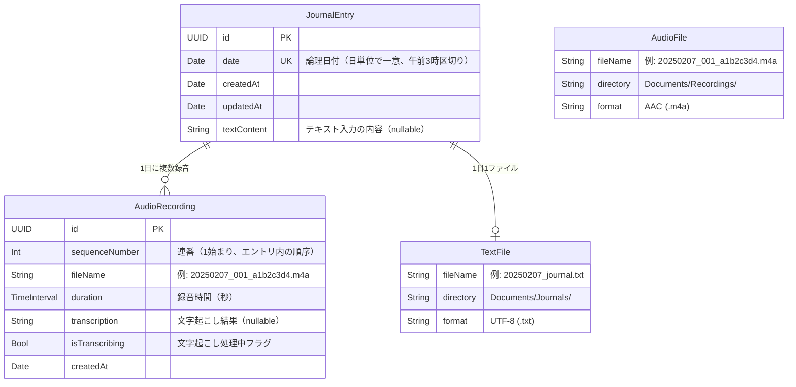

# iOS ジャーナリングアプリ 設計プロンプト

## アプリ概要

毎日の記録をテキストと音声で残せるジャーナリングアプリ。
音声入力は録音保存に加えて文字起こしも行い、手軽に振り返りができる。

**本アプリの主な目的は、日々の記録を AI アプリに連携・共有し、分析してもらうためのフロントエンドとなること。**
ユーザーは本アプリで手軽に音声やテキストを記録し、
それらのデータを AI アプリに渡して振り返り・要約・傾向分析などを行う。
現時点では主に Google NotebookLM を連携先として想定しているが、
将来的には他の AI アプリ（ChatGPT、Gemini、Claude 等）への連携も視野に入れる。

## 技術スタック

| 項目 | 選定 |
|------|------|
| UI フレームワーク | SwiftUI |
| データ永続化 | SwiftData |
| 音声録音 | AVFoundation (AVAudioRecorder) |
| 音声文字起こし | SpeechAnalyzer / SpeechTranscriber（iOS 26 新API） |
| 波形表示 | OSS ライブラリを使用（後述） |
| 最小対応 OS | iOS 26.0（SpeechAnalyzer + SwiftData） |
| データ保存先 | ローカルのみ |

### 波形表示ライブラリ候補

必要に応じて以下のオープンソースライブラリから選定する。すべて SPM 対応・MIT ライセンス。

| ライブラリ | 用途 | 特徴 |
|-----------|------|------|
| [DSWaveformImage](https://github.com/dmrschmidt/DSWaveformImage) | 録音中のリアルタイム波形 + ファイル波形表示 | SwiftUI ネイティブ対応、ライブ録音用 `WaveformLiveView` とファイル用 `WaveformView` の両方あり。依存ゼロ、Stars 1,200+、活発にメンテナンス中 |
| [AudioKit/Waveform](https://github.com/AudioKit/Waveform) | ファイル波形表示 | GPU アクセラレーション（Metal）、SwiftUI 対応。AudioKit エコシステム |
| [FDWaveformView](https://github.com/fulldecent/FDWaveformView) | ファイル波形表示 + スクラブ | ズーム・スクロール・スクラブ操作対応。UIKit ベース |

**推奨: DSWaveformImage** — 録音中のリアルタイム波形（`WaveformLiveView`）と再生時のファイル波形（`WaveformView`）の両方をカバーでき、依存ライブラリもゼロ、SwiftUI にネイティブ対応している。

## データモデル

SwiftData の `@Model` マクロはすでに Observable に準拠しているため、
モデル層はそのまま SwiftUI のリアクティブ更新に対応する。
ViewModel 層では `@Observable` マクロ（Observation フレームワーク）を使用する。

### ER図



- `JournalEntry` は SwiftData で管理されるエンティティ（1日1エントリ）
- `AudioRecording` は SwiftData で管理される子エンティティ（1エントリに対して複数）
- `AudioFile` / `TextFile` は物理ファイル（DB 外）を表す概念エンティティ
- `AudioRecording.fileName` と `AudioFile.fileName` が対応する
- `JournalEntry.textContent` の内容が `TextFile` に同期書き出しされる
- 1日1エントリに対して、録音ファイルは複数（0〜N）、テキストファイルは最大1つ（0 or 1）
- 共有時には複数の音声ファイルを連番順に結合し、1つの音声ファイルとしてエクスポートする

### JournalEntry（日記エントリ）

1日1エントリ。テキストファイルは1日1ファイル。
**録音は1日に複数回行え、それぞれ独立した音声ファイルとして保存される。**
共有時に複数の録音ファイルを連番順に結合し、1つの音声ファイルとしてエクスポートする。

**日付変更のしきい値は午前3:00。**
0:00〜2:59 の操作は前日のエントリに記録される。
例: 2月8日 午前1:30 の録音 → 2月7日のエントリに追加。

```swift
@Model
class JournalEntry {
    var id: UUID
    var date: Date                    // エントリの日付（日単位で一意）
    var createdAt: Date
    var updatedAt: Date
    var textContent: String?          // テキスト入力の内容

    @Relationship(deleteRule: .cascade)
    var recordings: [AudioRecording]  // 1日に複数の録音（連番順で管理）

    /// 全録音の合計時間（秒）
    var totalAudioDuration: TimeInterval {
        recordings.reduce(0) { $0 + $1.duration }
    }
}
```

### AudioRecording（個別の録音）

1回の録音セッションに対応するモデル。
録音中は中断（一時停止）・再開が可能で、同一ファイルに追記される。
録音を停止すると確定し、新しい録音は別の AudioRecording として作成される。

```swift
@Model
class AudioRecording {
    var id: UUID
    var sequenceNumber: Int           // 連番（1始まり、エントリ内の順序）
    var fileName: String              // 音声ファイル名（例: 20250207_001_a1b2c3d4.m4a）
    var duration: TimeInterval        // この録音の時間（秒）
    var transcription: String?        // 文字起こし結果
    var isTranscribing: Bool          // 文字起こし処理中フラグ
    var createdAt: Date

    @Relationship(inverse: \JournalEntry.recordings)
    var entry: JournalEntry?
}
```

### ViewModel 層（@Observable）

```swift
import Observation
import SwiftData

@Observable
class HomeViewModel {
    // 録音状態
    var isRecording = false
    var isPaused = false              // 録音一時停止中
    var recordingDuration: TimeInterval = 0
    var currentRecording: AudioRecording? // 現在録音中のレコード

    // 再生状態
    var isPlaying = false
    var playingRecording: AudioRecording? // 現在再生中のレコード
    var playbackProgress: TimeInterval = 0

    var todayEntry: JournalEntry?
    var errorMessage: String?

    private let modelContext: ModelContext
    private let audioRecorder: AudioRecorderService
    private let audioPlayer: AudioPlayerService
    private let transcriptionService: TranscriptionService

    init(modelContext: ModelContext) {
        self.modelContext = modelContext
        self.audioRecorder = AudioRecorderService()
        self.audioPlayer = AudioPlayerService()
        self.transcriptionService = TranscriptionService()
    }

    // 録音操作
    func startNewRecording() { /* 新しい録音を開始。連番を自動付与 */ }
    func pauseRecording() { /* 録音を一時停止（中断） */ }
    func resumeRecording() { /* 一時停止した録音を再開 */ }
    func stopRecording() async { /* 録音を停止・確定し、文字起こしを開始 */ }

    // 再生操作
    func playRecording(_ recording: AudioRecording) { /* 指定した録音を再生 */ }
    func pausePlayback() { /* 再生を一時停止 */ }
    func stopPlayback() { /* 再生を停止 */ }

    // 録音管理
    func deleteRecording(_ recording: AudioRecording) { /* 個別の録音を削除 */ }
    func fetchTodayEntry() { /* ... */ }
}

@Observable
class HistoryViewModel {
    var entries: [JournalEntry] = []
    var searchText = ""
    var filteredEntries: [JournalEntry] {
        guard !searchText.isEmpty else { return entries }
        return entries.filter { /* テキスト・文字起こし内容をフィルタ */ }
    }

    private let modelContext: ModelContext

    init(modelContext: ModelContext) {
        self.modelContext = modelContext
    }

    func fetchEntries() { /* ... */ }
    func deleteEntry(_ entry: JournalEntry) { /* ... */ }
}

@Observable
class EntryDetailViewModel {
    var entry: JournalEntry
    var isEditing = false

    // 再生状態
    var isPlaying = false
    var playingRecording: AudioRecording?
    var playbackProgress: TimeInterval = 0

    private let modelContext: ModelContext
    private let audioPlayer: AudioPlayerService
    private let shareService: ShareService
    private let audioMerger: AudioMergerService

    init(entry: JournalEntry, modelContext: ModelContext) {
        self.entry = entry
        self.modelContext = modelContext
        self.audioPlayer = AudioPlayerService()
        self.shareService = ShareService()
        self.audioMerger = AudioMergerService()
    }

    // 再生操作
    func playRecording(_ recording: AudioRecording) { /* 個別録音を再生 */ }
    func pausePlayback() { /* ... */ }
    func stopPlayback() { /* ... */ }

    // 共有（ファイル結合 → エクスポート）
    func exportForSharing(options: ShareOptions) async -> [any Transferable] {
        // 音声共有時: 複数の録音ファイルを連番順に結合して1ファイルにする
        /* ... */
    }
}
```

### View での利用パターン

```swift
struct HomeView: View {
    @State private var viewModel: HomeViewModel

    init(modelContext: ModelContext) {
        _viewModel = State(initialValue: HomeViewModel(modelContext: modelContext))
    }

    var body: some View {
        // @Observable により viewModel のプロパティ変更で自動再描画
        // @ObservedObject や @Published は不要
    }
}
```

### SwiftData クエリとの使い分け

- **単純な一覧取得**: View 内で `@Query` マクロを直接使用
- **複雑なロジックを伴う操作**: `@Observable` な ViewModel 経由で `ModelContext` を操作

```swift
// @Query を直接使うパターン（シンプルな一覧）
struct HistoryListView: View {
    @Query(sort: \JournalEntry.date, order: .reverse)
    private var entries: [JournalEntry]
    // ...
}

// ViewModel を使うパターン（複雑な操作）
struct HomeView: View {
    @State private var viewModel: HomeViewModel
    // ...
}
```

## 画面構成

### 画面 1: ホーム画面（メイン入力画面）

アプリ起動時に表示される画面。今日の記録を素早く開始できることを最優先にする。

**レイアウト要素:**

- **日付表示（上部）** — 論理日付を「2025年2月7日（金）」のようなフォーマットで表示。午前3時より前は前日の日付を表示する
- **録音コントロール（中央・目立つ配置）** — 以下の操作ボタンを持つ:
  - **録音開始ボタン**（`mic.circle.fill`）— タップで新しい録音を開始。録音中はリアルタイム波形を表示（DSWaveformImage の `WaveformLiveView` 等を使用）
  - **中断ボタン**（`pause.circle.fill`）— 録音中に表示。タップで録音を一時停止。再度タップで再開（同一ファイルに追記）
  - **停止ボタン**（`stop.circle.fill`）— 録音中 or 一時停止中に表示。タップで録音を確定・保存し、文字起こしを開始
- **テキスト入力ボタン（録音コントロールの近く）** — タップでテキスト入力モードに遷移 or シートを表示。既にテキストがある場合は編集モードで開く
- **今日の録音一覧（下部）** — 今日の録音がある場合、連番付きリストで表示:
  - 各録音: 連番、録音時間、文字起こし状態（処理中 / 完了）
  - タップで個別の再生が可能
  - **再生ボタン**（`play.circle`）— タップで該当録音を再生
  - **再生中断ボタン**（`pause.circle`）— 再生中に表示。タップで再生を一時停止
  - スワイプで個別削除
- **今日のエントリプレビュー（下部）** — テキストの先頭部分、録音件数、合計録音時間を簡易表示

**動作フロー（録音）:**

1. 録音開始ボタンをタップ → 新しい AudioRecording を作成し、AVAudioRecorder で録音開始
2. 中断ボタンをタップ → 録音を一時停止（`AVAudioRecorder.pause()`）
3. 中断ボタンを再度タップ → 録音を再開（同一ファイルに追記）
4. 手順 2〜3 を何度でも繰り返し可能
5. 停止ボタンをタップ → 録音を確定し、ファイルを保存。AudioRecording の duration を記録
6. バックグラウンドで SpeechAnalyzer による文字起こしを実行
7. 文字起こし完了後、AudioRecording の transcription を更新
8. **同日中に再度録音開始ボタンを押した場合 → 新しい AudioRecording（次の連番）として別ファイルに保存**

※ 30分の上限は1日の全録音の累計時間（`JournalEntry.totalAudioDuration`）に対して適用。上限に達したら自動で録音を停止し、ユーザーに通知する。

**動作フロー（再生）:**

1. 録音一覧から再生ボタンをタップ → AVAudioPlayer で該当録音を再生
2. 中断ボタンをタップ → 再生を一時停止
3. 中断ボタンを再度タップ → 再生を再開
4. 再生が終了するか、別の録音の再生ボタンをタップすると現在の再生は停止

**動作フロー（テキスト）:**

1. テキスト入力ボタンをタップ → テキストエディタを表示
2. 保存 → JournalEntry の textContent を更新し、`Journals/{date}_journal.txt` も同期更新

### 画面 2: 履歴一覧画面

過去の日記エントリを日付ごとに一覧表示する画面。

**レイアウト要素:**

- **日付ごとのリスト** — 新しい日付が上に来る降順表示。各セルに以下を表示:
  - 日付（例: 2月6日 木）
  - テキストの先頭数行（プレビュー）
  - 録音件数と合計時間の表示（例: 3件 / 12m30s）、録音なしの場合は非表示
- **検索バー（上部）** — テキスト内容・文字起こし内容をフルテキスト検索

**タップ時の遷移:**

- セルをタップ → エントリ詳細画面へ遷移

### 画面 3: エントリ詳細画面（履歴からの遷移先）

特定の日のエントリを閲覧・編集する画面。

**表示要素:**

- 日付ヘッダー
- テキスト内容（編集可能）
- 録音セクション（録音がある場合）:
  - **録音一覧** — 連番順にリスト表示。各録音に以下を表示:
    - 連番ラベル（例: Recording 01, Recording 02）
    - 録音時間
    - 再生ボタン / 一時停止ボタン
    - 文字起こしテキスト（展開/折りたたみ可能）
    - 個別削除ボタン（スワイプ）
  - 合計録音時間の表示（全録音の合計）

## ナビゲーション構成

```
TabView {
    Tab("今日", systemImage: "mic.circle.fill") {
        HomeView()           // 画面 1
    }
    Tab("履歴", systemImage: "calendar") {
        HistoryListView()    // 画面 2
            → EntryDetailView()  // 画面 3（NavigationStack で push）
    }
}
```

## 必要なパーミッション（Info.plist）

| キー | 用途 |
|------|------|
| `NSMicrophoneUsageDescription` | 音声録音のためにマイクを使用します |
| `NSSpeechRecognitionUsageDescription` | 録音した音声をテキストに変換するために使用します |

※ iOS 26 の SpeechAnalyzer ではユーザーが設定で言語を追加する必要がなくなった。
言語モデルは自動的にダウンロード・管理される。

## 音声ファイルの管理方針

### 保存先

`Documents/` ディレクトリ以下にすべてのファイルを保存する。
音声・テキストのすべてがファイルアプリから閲覧可能。
**1日につき音声ファイルは複数（録音ごとに1ファイル）、テキストファイルは1つ生成する。**

```
Documents/
├── Recordings/          # 音声ファイル（1日に複数、連番付き）
│   ├── 20250207_001_a1b2c3d4.m4a
│   ├── 20250207_002_e5f6g7h8.m4a
│   ├── 20250207_003_i9j0k1l2.m4a
│   └── 20250208_001_m3n4o5p6.m4a
├── Merged/              # 共有用の結合済み音声ファイル（一時生成）
│   └── 20250207_merged.m4a
└── Journals/            # テキスト日記（1日1ファイル）
    ├── 20250207_journal.txt
    └── 20250208_journal.txt
```

### ファイルアプリからのアクセス

iOS のファイルアプリ（「このiPhone内」→「（アプリ名）」）から
すべてのファイルを直接閲覧・共有できるようにする。

**Info.plist に以下を追加:**

```xml
<key>UIFileSharingEnabled</key>
<true/>
<key>LSSupportsOpeningDocumentsInPlace</key>
<true/>
```

| キー | Xcode 表示名 | 値 |
|------|-------------|-----|
| `UIFileSharingEnabled` | Application supports iTunes file sharing | YES |
| `LSSupportsOpeningDocumentsInPlace` | Supports opening documents in place | YES |

※ SwiftData のストアファイルは `Application Support` に保存されるため、
`Documents` を公開してもデータベースファイルは露出しない。

### ファイル命名規則

**重要: ファイル名は半角英数字・ハイフン・アンダースコアのみを使用する。**
日本語を含めると NotebookLM へのインポート時に文字化けが発生するため禁止。
**すべてのファイルは日付（`YYYYMMDD`）をプリフィックスとし、ファイルアプリでの日付順ソートを保証する。**

**音声ファイル（録音ごとに1ファイル、連番付き）:**

```
Recordings/{date}_{seq}_{short-id}.m4a
```

| 要素 | 内容 | 例 |
|------|------|-----|
| `{date}` | 録音日（`YYYYMMDD`） | `20250207` |
| `{seq}` | 連番（3桁ゼロ埋め） | `001`, `002`, `003` |
| `{short-id}` | UUID の先頭8文字（衝突回避用） | `a1b2c3d4` |

例: `20250207_001_a1b2c3d4.m4a`, `20250207_002_e5f6g7h8.m4a`

- 録音開始のたびに新しいファイルを生成（連番を自動インクリメント）
- 録音中の中断→再開は同一ファイルに追記される
- 停止すると録音が確定し、次の録音は新しいファイルとして作成される

**結合済み音声ファイル（共有時に一時生成）:**

```
Merged/{date}_merged.m4a
```

例: `20250207_merged.m4a`

- 共有ボタンで音声を選択した際に、複数の録音ファイルを連番順に結合して生成
- `AVMutableComposition` を使用してファイルを無劣化結合
- 共有完了後、一定期間（アプリ次回起動時等）に `Merged/` 内の古いファイルを自動クリーンアップ

**テキスト日記ファイル:**

```
Journals/{date}_journal.txt
```

例: `20250207_journal.txt`

- エントリ保存時に自動で生成・上書き更新される
- アプリ内でテキストを編集するたびにファイルも同期更新

### ファイルの同期タイミング

| イベント | 更新されるファイル |
|---------|-----------------|
| テキスト入力を保存 | `Journals/{date}_journal.txt` を生成 or 上書き |
| 録音開始 | `Recordings/{date}_{seq}_{id}.m4a` を新規生成 |
| 録音の中断・再開 | 同一の `.m4a` ファイルに追記 |
| 録音停止 | `.m4a` ファイルを確定。AudioRecording の duration を記録 |
| 再度録音開始 | 次の連番で `Recordings/{date}_{seq+1}_{id}.m4a` を新規生成 |
| 文字起こし完了 | SwiftData（`AudioRecording.transcription`）に保存 |
| 音声共有時 | 全録音を連番順に結合し `Merged/{date}_merged.m4a` を生成 |
| 個別録音削除 | 対応する `.m4a` を削除し、AudioRecording をDBから削除 |
| エントリ削除 | 対応する全 `.m4a`、`_merged.m4a`、`_journal.txt` を削除 |

### フォーマット

- 音声: AAC（`.m4a`）
- 録音の最大時間: 30分（1日の全録音の累計。上限に達したら自動停止し、ユーザーに通知）
- 1回の録音に時間制限はなし（累計30分の範囲内で自由）
- テキスト: UTF-8（`.txt`）
- 容量表示機能は将来的に追加を検討

## 文字起こしの仕様（SpeechAnalyzer — iOS 26 新API）

iOS 26 で導入された `SpeechAnalyzer` + `SpeechTranscriber` を使用する。
従来の `SFSpeechRecognizer` に比べ、長時間音声への対応、高速処理、完全オフライン動作が大幅に改善されている。

### 基本実装パターン

```swift
import Speech
import AVFoundation

let locale = Locale(identifier: "ja_JP")
let transcriber = SpeechTranscriber(locale: locale, preset: .offlineTranscription)
let analyzer = SpeechAnalyzer(modules: [transcriber])

// 録音済みファイルから文字起こし
let audioFile = try AVAudioFile(forReading: fileURL)
if let lastSample = try await analyzer.analyzeSequence(from: audioFile) {
    try await analyzer.finalizeAndFinish(through: lastSample)
}

// 結果の取得（AsyncSequence）
for await result in transcriber.results {
    let text = result.text  // AttributedString
    let isFinal = result.isFinal
    if isFinal {
        // 確定テキストを保存
    }
}
```

### 主要コンポーネント

| クラス | 役割 |
|--------|------|
| `SpeechAnalyzer` | 分析セッションを管理。モジュールを追加して使用 |
| `SpeechTranscriber` | 音声→テキスト変換モジュール |
| `SpeechDetector` | 音声区間の検出（VAD）。フルの文字起こしなしで音声有無を判定 |

### プリセット

- `.offlineTranscription` — オフライン専用。録音済みファイルの一括処理に最適
- `.transcription` — 汎用的な文字起こし

### 仕様詳細

- 完全オンデバイス処理（ネットワーク不要、プライバシー確保）
- 言語モデルの自動ダウンロード・管理（ユーザーが設定で言語追加する必要なし）
- `ja_JP` はサポート対象ロケールに含まれる
- 結果は `AttributedString` で返却され、タイミングデータも含まれる
- volatile（暫定）と finalized（確定）の2段階で結果がストリーム配信される
- 録音停止後にバックグラウンドで非同期実行
- 処理中は `isTranscribing = true` でインジケータ表示
- 文字起こし失敗時はエラーメッセージを表示し、リトライボタンを提供

### デバイスサポートのフォールバック

```swift
if SpeechTranscriber.supportsDevice() {
    // SpeechTranscriber を使用
} else {
    // DictationTranscriber にフォールバック（旧 SFSpeechRecognizer の改良版）
    let dictationTranscriber = DictationTranscriber(locale: locale)
}
```

## 共有機能（NotebookLM 連携）

ジャーナルデータを NotebookLM にソースとして送り、AI による分析・振り返りを行う。

### 共有方式

NotebookLM には直接的な iOS URL Scheme やモバイル API は提供されていないため、
iOS 標準の共有機能（`ShareLink` / `UIActivityViewController`）を活用し、
NotebookLM が受け取れる形式でデータをエクスポートする。

### 共有対象データと形式

| 共有タイプ | 形式 | 説明 | NotebookLM での扱い |
|-----------|------|------|-------------------|
| テキスト日記 | `.txt` ファイル（Documents に常時保存） | そのまま共有 | テキストソースとして読み込み |
| 文字起こしテキスト | 共有時にDBから取得し `.txt` として一時生成 | 全録音の文字起こしを連結 | テキストソースとして読み込み |
| 音声ファイル（結合済み） | `.m4a`（共有時に結合して生成） | **複数の録音を連番順に1ファイルに結合** | 音声ソースとして読み込み（自動文字起こし） |

※ NotebookLM は m4a, mp3, wav, aac 等の音声ファイルを直接ソースとしてインポート可能。
音声をアップロードすると NotebookLM 側でも自動で文字起こしが行われる。

### 音声ファイル結合の仕様

共有ボタンで音声ファイルを選択した際、その日の全録音ファイルを連番順に結合して1つのファイルを生成する。

**結合処理:**

```swift
// AVFoundation を使用した無劣化結合
let composition = AVMutableComposition()
let compositionTrack = composition.addMutableTrack(
    withMediaType: .audio,
    preferredTrackID: kCMPersistentTrackID_Invalid
)

// 連番順にソートされた録音ファイルを順次結合
let sortedRecordings = entry.recordings.sorted { $0.sequenceNumber < $1.sequenceNumber }
var currentTime = CMTime.zero

for recording in sortedRecordings {
    let asset = AVURLAsset(url: recording.fileURL)
    let assetTrack = try await asset.loadTracks(withMediaType: .audio).first!
    let timeRange = CMTimeRange(start: .zero, duration: try await asset.load(.duration))
    try compositionTrack?.insertTimeRange(timeRange, of: assetTrack, at: currentTime)
    currentTime = CMTimeAdd(currentTime, timeRange.duration)
}

// AAC (.m4a) としてエクスポート
let exportSession = AVAssetExportSession(asset: composition, presetName: AVAssetExportPresetAppleM4A)!
exportSession.outputURL = mergedFileURL  // Merged/{date}_merged.m4a
exportSession.outputFileType = .m4a
await exportSession.export()
```

**結合の動作仕様:**

- 録音が1つだけの場合は結合処理をスキップし、元ファイルをそのまま共有
- 結合済みファイルは `Documents/Merged/` に一時保存
- 結合ファイルのクリーンアップ: アプリ起動時に作成から24時間以上経過した `Merged/` 内のファイルを自動削除
- 結合中はプログレスインジケータを表示（大量の録音がある場合に備えて）

### 共有ボタンの配置

1. **エントリ詳細画面** — ナビゲーションバーに共有ボタン（`square.and.arrow.up`）

### 共有フロー

```
共有ボタンタップ
  ↓
共有内容の選択シート表示:
  □ テキスト日記
  □ 文字起こしテキスト
  □ 音声ファイル（結合済み）
  ↓
選択に応じてエクスポートデータを生成
  ├── 音声選択時: 複数録音を連番順に結合 → 結合済み .m4a を生成
  │   （結合中はプログレスインジケータ表示）
  └── テキスト選択時: そのまま or DB から生成
  ↓
iOS Share Sheet を表示
  ↓
ユーザーが共有先を選択:
  - 「ファイルに保存」→ Google Drive に保存 → NotebookLM からインポート
  - AirDrop → Mac/iPad → NotebookLM Web で直接アップロード
  - その他の共有先（メール、メッセージ等）
```

### エクスポートフォーマット例（テキスト）

ファイル名: `20250207_journal.txt`

```
# Journal: 2025-02-07 (Fri)

## Text Entry
今日は朝からプロジェクトの打ち合わせがあった。
新機能の方向性について議論し、良い結論が出た。

## Recording 01 (14:30 / 3m24s)
### Transcription
打ち合わせ後に思ったことをメモ。
来週までにプロトタイプを作成する必要がある...

## Recording 02 (18:00 / 5m10s)
### Transcription
夕方の進捗確認。デザインレビューの結果を反映した...

## Recording 03 (21:15 / 1m52s)
### Transcription
今日の振り返り。全体的に生産的な一日だった...
```

※ ファイル名とヘッダーラベルは半角英数字のみ。本文は日本語を含んでよい。
※ 文字起こしテキストの共有時は、全録音の文字起こしを連番順に連結して1つの `.txt` ファイルとして出力する。

### エクスポートフォーマット例（音声）

ファイル名: `20250207_merged.m4a`

- その日の全録音ファイル（`20250207_001_xxx.m4a`, `20250207_002_xxx.m4a`, ...）を連番順に結合
- AAC (.m4a) 形式で無劣化エクスポート
- 録音が1件のみの場合は結合せず元ファイルをそのまま共有

## 実装時の注意事項

- **SpeechAnalyzer の言語モデル**: 初回起動時に日本語モデルがまだダウンロードされていない可能性がある。初回起動時にモデルの準備状況をチェックし、未ダウンロードならプログレス表示付きでダウンロードを促すオンボーディングを入れる
- **ファイルアプリとの整合性**: ユーザーがファイルアプリから音声ファイルを直接削除した場合、SwiftData 上のレコードと不整合が起きる。アプリ起動時やエントリ表示時にファイルの存在チェックを行い、不整合があれば UI で通知する
- **NotebookLM の制約**: ソース1つあたり 500,000語 / 200MB の上限がある。共有時に結合後のファイルサイズを表示してユーザーに判断材料を提供する
- **音声ファイル結合の非同期処理**: `AVAssetExportSession` による結合処理は非同期で行い、結合中はプログレスインジケータを表示する。結合に失敗した場合はエラーメッセージを表示し、リトライボタンを提供する
- **Merged ディレクトリのクリーンアップ**: アプリ起動時に `Documents/Merged/` 内の作成から24時間以上経過したファイルを自動削除し、ストレージを圧迫しないようにする
- **録音の連番管理**: 録音削除時に連番の振り直しは行わない（欠番を許容）。連番は表示順序の保証のみに使用する

## 考慮事項・将来の拡張

- **iCloud 同期**: SwiftData の CloudKit 連携で将来対応可能
- **一括エクスポート**: 期間を指定して複数日分のジャーナルをまとめてエクスポート
- **NotebookLM Enterprise API 連携**: Google Cloud の NotebookLM Enterprise API が利用可能になれば、アプリから直接ノートブックにソースを追加する自動化が可能
- **ウィジェット**: ホーム画面から直接録音を開始するウィジェット
- **リマインダー通知**: 毎日の記録を促すローカル通知
- **エクスポート機能**: テキスト + 文字起こしをまとめて PDF 出力
- **タグ / カテゴリ**: エントリにタグを付けて分類
- **気分トラッキング**: エントリに気分アイコンを付与
- **Foundation Models 連携**: iOS 26 のオンデバイス Foundation Models を使い、ジャーナルの要約やタイトル自動生成
