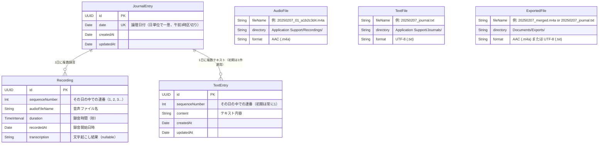

# iOS ジャーナリングアプリ 設計プロンプト

## アプリ概要

**コードネーム: MindEcho**

毎日の記録をテキストと音声で残せるジャーナリングアプリ。
音声入力は録音保存に加えて文字起こしも行い、手軽に振り返りができる。

**本アプリの主な目的は、日々の記録を AI アプリに連携・共有し、分析してもらうためのフロントエンドとなること。**
ユーザーは本アプリで手軽に音声やテキストを記録し、
それらのデータを AI アプリに渡して振り返り・要約・傾向分析などを行う。
現時点では主に Google NotebookLM を連携先として想定しているが、
将来的には他の AI アプリ（ChatGPT、Gemini、Claude 等）への連携も視野に入れる。

## 技術スタック

| 項目 | 選定 |
|------|------|
| UI フレームワーク | SwiftUI |
| データ永続化 | SwiftData |
| 音声録音 | AVFoundation (AVAudioRecorder) |
| 音声文字起こし | SpeechAnalyzer / SpeechTranscriber（iOS 26 新API） |
| 波形表示 | OSS ライブラリを使用（後述） |
| 最小対応 OS | iOS 26.0（SpeechAnalyzer + SwiftData） |
| データ保存先 | ローカルのみ |

### 波形表示ライブラリ候補

必要に応じて以下のオープンソースライブラリから選定する。すべて SPM 対応・MIT ライセンス。

| ライブラリ | 用途 | 特徴 |
|-----------|------|------|
| [DSWaveformImage](https://github.com/dmrschmidt/DSWaveformImage) | 録音中のリアルタイム波形 + ファイル波形表示 | SwiftUI ネイティブ対応、ライブ録音用 `WaveformLiveView` とファイル用 `WaveformView` の両方あり。依存ゼロ、Stars 1,200+、活発にメンテナンス中 |
| [AudioKit/Waveform](https://github.com/AudioKit/Waveform) | ファイル波形表示 | GPU アクセラレーション（Metal）、SwiftUI 対応。AudioKit エコシステム |
| [FDWaveformView](https://github.com/fulldecent/FDWaveformView) | ファイル波形表示 + スクラブ | ズーム・スクロール・スクラブ操作対応。UIKit ベース |

**推奨: DSWaveformImage** — 録音中のリアルタイム波形（`WaveformLiveView`）と再生時のファイル波形（`WaveformView`）の両方をカバーでき、依存ライブラリもゼロ、SwiftUI にネイティブ対応している。

## モジュール構成

マルチモジュール構成（Swift Package）で開発する。5つのライブラリモジュール + 1つのアプリターゲットに分割する。

### 依存関係

```
MindEchoApp (App Target)
├── MindEchoCore
├── AudioService
├── AudioMerger
├── Transcription
└── ExportService
    ├── MindEchoCore
    └── AudioMerger
```

### モジュール一覧

| モジュール | 責務 | 主な型 | 依存先 |
|-----------|------|--------|--------|
| **MindEchoCore** | ドメインモデル, 日付ロジック（午前3時境界）, ファイルパス/命名規則, ディレクトリ管理 | `JournalEntry`, `Recording`, `TextEntry`, `DateHelper`, `FilePathManager` | Foundation, SwiftData |
| **AudioService** | 録音（一時停止/再開含む）, 再生（プログレス追跡含む）, AVAudioSession 管理 | `AudioRecorderService`, `AudioPlayerService` | AVFoundation |
| **AudioMerger** | 複数音声ファイルの結合, TTS 日付アナウンス生成, 無音挿入 | `AudioMerger`, `TTSGenerator` | AVFoundation |
| **Transcription** | SpeechAnalyzer/SpeechTranscriber ラッパー, リアルタイム文字起こしストリーム | `TranscriptionService` | Speech |
| **ExportService** | エクスポート生成（テキスト/文字起こし/音声）, Documents/Exports/ へのコピー, クリーンアップ（7日/24時間） | `ExportService`, `FileCleanupManager` | MindEchoCore, AudioMerger |
| **MindEchoApp** | Views, ViewModels, App lifecycle | `HomeView`, `HomeViewModel` 等 | 全モジュール |

### 設計方針

- **AudioService** は録音と再生をまとめる。どちらも AVAudioSession の管理が必要でセッション設定を共有でき、単体では1〜2ファイル程度のためモジュールとしては薄すぎる
- **AudioMerger** は独立モジュールとする。録音・再生（リアルタイム操作）とマージ（バッチ処理）は性質が異なり、入出力が `[URL] → URL` と明確で他モジュールへの依存がない
- **AudioService, AudioMerger, Transcription** は MindEchoCore に依存しない。ファイルパス（URL）や文字列など基本型のみで動作し、ドメインモデルとの紐付けは ViewModel 層（App Target）が担う
- **ExportService** は MindEchoCore に依存する。テキストエクスポートのフォーマット生成にドメイン構造の知識が必要なため

## データモデル

SwiftData の `@Model` マクロはすでに Observable に準拠しているため、
モデル層はそのまま SwiftUI のリアクティブ更新に対応する。
ViewModel 層では `@Observable` マクロ（Observation フレームワーク）を使用する。

### ER図



- `JournalEntry` は SwiftData で管理される日単位のエンティティ
- `Recording` は SwiftData で管理される録音単位のエンティティ（`JournalEntry` に紐づく）
- `TextEntry` は SwiftData で管理されるテキスト単位のエンティティ（`JournalEntry` に紐づく）
- `AudioFile` / `TextFile` は物理ファイル（DB 外）を表す概念エンティティ
- `Recording.audioFileName` と `AudioFile.fileName` が対応する
- `TextEntry.content` の内容が `TextFile` に同期書き出しされる
- 1日1エントリに対して、録音は複数（0〜N）、テキストも複数（0〜N、**初期は0〜1件で運用**）

### JournalEntry（日記エントリ）

1日1エントリ。
録音は1日に何度でも行え、それぞれ個別のファイル・個別の `Recording` として管理される。
テキストも `TextEntry` として独立管理する。**初期バージョンでは1日1テキストの運用だが、将来的に複数テキスト対応を可能にするため、最初から1対多のリレーションで設計する。**

**日付変更のしきい値は午前3:00。**
0:00〜2:59 の操作は前日のエントリに記録される。
例: 2月8日 午前1:30 の録音 → 2月7日のエントリに追加。

```swift
@Model
class JournalEntry {
    var id: UUID
    var date: Date                    // エントリの日付（日単位で一意）
    var createdAt: Date
    var updatedAt: Date
    @Relationship(deleteRule: .cascade)
    var recordings: [Recording]       // その日の録音リスト（連番順）
    @Relationship(deleteRule: .cascade)
    var textEntries: [TextEntry]      // その日のテキストリスト（連番順、初期は0〜1件）

    /// その日の合計録音時間（秒）
    var totalDuration: TimeInterval {
        recordings.reduce(0) { $0 + $1.duration }
    }
}

@Model
class Recording {
    var id: UUID
    var sequenceNumber: Int           // その日の中での連番（1, 2, 3...）
    var audioFileName: String         // 音声ファイル名
    var duration: TimeInterval        // 録音時間（秒）
    var recordedAt: Date              // 録音開始日時
    var transcription: String?        // 文字起こし結果（リアルタイム文字起こしの確定テキスト）

    @Relationship(inverse: \JournalEntry.recordings)
    var entry: JournalEntry?
}

@Model
class TextEntry {
    var id: UUID
    var sequenceNumber: Int           // その日の中での連番（初期は常に1）
    var content: String               // テキスト内容
    var createdAt: Date
    var updatedAt: Date

    @Relationship(inverse: \JournalEntry.textEntries)
    var entry: JournalEntry?
}
```

### ViewModel 層（@Observable）

```swift
import Observation
import SwiftData

@Observable
class HomeViewModel {
    // 録音状態
    var isRecording = false
    var isPaused = false              // 録音一時停止中
    var recordingDuration: TimeInterval = 0
    
    // リアルタイム文字起こし
    var liveTranscription = ""        // 録音中のリアルタイム文字起こしテキスト（暫定）
    var isTranscribing = false        // 文字起こし処理中
    
    // 再生（録音直後の再生用）
    var playingRecordingId: UUID?     // 現在再生中の Recording の ID（nil = 再生なし）
    var isPlaying = false
    var playbackProgress: Double = 0  // 0.0〜1.0

    var todayEntry: JournalEntry?
    var errorMessage: String?

    private let modelContext: ModelContext
    private let audioRecorder: AudioRecorderService
    private let audioPlayer: AudioPlayerService
    private let transcriptionService: TranscriptionService

    init(modelContext: ModelContext) {
        self.modelContext = modelContext
        self.audioRecorder = AudioRecorderService()
        self.audioPlayer = AudioPlayerService()
        self.transcriptionService = TranscriptionService()
    }

    func startRecording() { /* 新しい録音セッションを開始。リアルタイム文字起こしも同時開始 */ }
    func pauseRecording() { /* 録音を一時停止 */ }
    func resumeRecording() { /* 一時停止中の録音を再開 */ }
    func stopRecording() async { /* 録音を停止・確定。確定テキストを Recording に保存 */ }
    func playRecording(_ recording: Recording) { /* 個別の録音を再生 */ }
    func pausePlayback() { /* 再生を一時停止 */ }
    func stopPlayback() { /* 再生を停止 */ }
    func saveText(_ text: String) { /* TextEntry を作成 or 更新。初期は1件のみ */ }
    func fetchTodayEntry() { /* ... */ }
}

@Observable
class HistoryViewModel {
    var entries: [JournalEntry] = []
    var searchText = ""
    var filteredEntries: [JournalEntry] {
        guard !searchText.isEmpty else { return entries }
        return entries.filter { /* TextEntry.content・Recording.transcription をフィルタ */ }
    }

    private let modelContext: ModelContext

    init(modelContext: ModelContext) {
        self.modelContext = modelContext
    }

    func fetchEntries() { /* ... */ }
    func deleteEntry(_ entry: JournalEntry) { /* ... */ }
}

@Observable
class EntryDetailViewModel {
    var entry: JournalEntry
    var isEditing = false
    
    // 再生状態
    var playingRecordingId: UUID?     // 現在再生中の Recording の ID
    var isPlaying = false
    var playbackProgress: Double = 0

    private let modelContext: ModelContext
    private let audioPlayer: AudioPlayerService
    private let shareService: ShareService

    init(entry: JournalEntry, modelContext: ModelContext) {
        self.entry = entry
        self.modelContext = modelContext
        self.audioPlayer = AudioPlayerService()
        self.shareService = ShareService()
    }

    func playRecording(_ recording: Recording) { /* 個別の録音を再生 */ }
    func pausePlayback() { /* 再生を一時停止 */ }
    func stopPlayback() { /* 再生を停止 */ }
    func deleteRecording(_ recording: Recording) { /* 個別の録音を削除（ファイルも削除） */ }
    func exportForSharing(options: ShareOptions) async -> [any Transferable] {
        /* 音声選択時: 全録音を連番順に結合した1つの .m4a を生成
           文字起こし選択時: 全録音の文字起こしを結合した .txt を生成
           テキスト選択時: 全 TextEntry を連番順に結合した .txt を生成 */
    }
}
```

### View での利用パターン

```swift
struct HomeView: View {
    @State private var viewModel: HomeViewModel

    init(modelContext: ModelContext) {
        _viewModel = State(initialValue: HomeViewModel(modelContext: modelContext))
    }

    var body: some View {
        // @Observable により viewModel のプロパティ変更で自動再描画
        // @ObservedObject や @Published は不要
    }
}
```

### SwiftData クエリとの使い分け

- **単純な一覧取得**: View 内で `@Query` マクロを直接使用
- **複雑なロジックを伴う操作**: `@Observable` な ViewModel 経由で `ModelContext` を操作

```swift
// @Query を直接使うパターン（シンプルな一覧）
struct HistoryListView: View {
    @Query(sort: \JournalEntry.date, order: .reverse)
    private var entries: [JournalEntry]
    // ...
}

// ViewModel を使うパターン（複雑な操作）
struct HomeView: View {
    @State private var viewModel: HomeViewModel
    // ...
}
```

## 画面構成

### 画面 1: ホーム画面（メイン入力画面）

アプリ起動時に表示される画面。今日の記録を素早く開始できることを最優先にする。

**レイアウト要素:**

- **日付表示（上部）** — 論理日付を「2025年2月7日（金）」のようなフォーマットで表示。午前3時より前は前日の日付を表示する
- **録音コントロール（中央・目立つ配置）** — 以下の操作ボタンを持つ:
  - **録音開始ボタン** — タップで新しい録音セッションを開始。リアルタイム文字起こしも同時に開始
  - **一時停止 / 再開ボタン** — 録音中に表示。タップで一時停止 ↔ 再開を切り替え（同一ファイル内）
  - **停止ボタン** — 録音中 or 一時停止中に表示。タップで録音を確定し、新しい `Recording` として保存
- **リアルタイム文字起こし表示（録音中）** — 録音中に画面下部などにリアルタイムで文字起こしテキストを表示。暫定テキスト（volatile）と確定テキスト（finalized）を視覚的に区別する
- **録音中の波形表示** — リアルタイム波形を表示（DSWaveformImage の `WaveformLiveView` 等を使用）
- **テキスト入力ボタン（録音ボタンの近く）** — タップでテキスト入力モードに遷移 or シートを表示。既にテキストがある場合は編集モードで開く
- **今日の録音リスト（下部）** — 今日既に録音がある場合、各録音を連番で一覧表示:
  - 連番（#1, #2, ...）
  - 録音時間
  - 再生 / 一時停止ボタン（個別再生）
  - 文字起こしテキストの先頭部分（プレビュー）

**動作フロー（録音）:**

1. 録音開始ボタンをタップ → AVAudioRecorder で録音開始 + SpeechTranscriber でリアルタイム文字起こし開始
2. リアルタイム文字起こしテキストが逐次表示される
3. 一時停止ボタンをタップ → 録音を一時停止（`AVAudioRecorder.pause()`）
4. 再開ボタンをタップ → 録音を再開（同一ファイルに追記）
5. 手順 3〜4 を何度でも繰り返し可能
6. 停止ボタンをタップ → 録音を確定し、ファイルを保存
7. 文字起こしの確定テキストを `Recording.transcription` に保存
8. 新しい `Recording` が今日の録音リストに追加される
9. 再度録音開始ボタンを押すと → 新しいファイル・新しい `Recording` として別セッションで録音開始


**動作フロー（テキスト）:**

1. テキスト入力ボタンをタップ → テキストエディタを表示
2. 保存 → `TextEntry` を作成 or 更新し、`Journals/{date}_journal.txt` も同期更新
3. 初期バージョンでは1日1件の `TextEntry` のみ。既にテキストがある場合は既存の `TextEntry` を編集する

### 画面 2: 履歴一覧画面

過去の日記エントリを日付ごとに一覧表示する画面。

**レイアウト要素:**

- **日付ごとのリスト** — 新しい日付が上に来る降順表示。各セルに以下を表示:
  - 日付（例: 2月6日 木）
  - テキストの先頭数行（プレビュー）
  - 録音件数と合計時間の表示（例: 🎤 3件 / 12m30s）、録音なしの場合は非表示
- **検索バー（上部）** — テキスト内容・文字起こし内容をフルテキスト検索

**タップ時の遷移:**

- セルをタップ → エントリ詳細画面へ遷移

### 画面 3: エントリ詳細画面（履歴からの遷移先）

特定の日のエントリを閲覧・編集する画面。

**表示要素:**

- 日付ヘッダー
- テキスト内容（編集可能）
- 録音セクション（録音がある場合）— 各 Recording を連番順にリスト表示:
  - 連番と録音時刻（例: #1 14:30）
  - 再生ボタン / 一時停止ボタン（個別再生）
  - 録音時間の表示
  - 波形表示（DSWaveformImage の `WaveformView` でファイル波形を表示）
  - 文字起こしテキスト（展開/折りたたみ可能）
  - 個別の録音削除ボタン（スワイプ or ボタン）

## ナビゲーション構成

```
TabView {
    Tab("今日", systemImage: "mic.circle.fill") {
        HomeView()           // 画面 1
    }
    Tab("履歴", systemImage: "calendar") {
        HistoryListView()    // 画面 2
            → EntryDetailView()  // 画面 3（NavigationStack で push）
    }
}
```

## 必要なパーミッション（Info.plist）

| キー | 用途 |
|------|------|
| `NSMicrophoneUsageDescription` | 音声録音のためにマイクを使用します |
| `NSSpeechRecognitionUsageDescription` | 録音した音声をテキストに変換するために使用します |

※ iOS 26 の SpeechAnalyzer ではユーザーが設定で言語を追加する必要がなくなった。
言語モデルは自動的にダウンロード・管理される。

## 音声ファイルの管理方針

### 保存先

アプリ内部で管理するファイルは `Application Support/` ディレクトリに保存し、ファイルアプリから不可視にする。
エクスポート（AI に共有）したファイルのみを `Documents/Exports/` に保存し、ファイルアプリから閲覧可能にする。
**1日につき録音ファイルは複数（セッションごと）、テキストファイルは1つのみ生成する。**

```
Application Support/
├── Recordings/          # 音声ファイル（1日に複数ファイル可、ファイルアプリから不可視）
│   ├── 20250207_01_a1b2c3d4.m4a
│   ├── 20250207_02_e5f6g7h8.m4a
│   ├── 20250207_03_i9j0k1l2.m4a
│   └── 20250208_01_m3n4o5p6.m4a
├── Merged/              # 共有用の結合済み音声ファイル（一時生成、ファイルアプリから不可視）
│   └── 20250207_merged.m4a
└── Journals/            # テキスト日記（1日1ファイル、ファイルアプリから不可視）
    ├── 20250207_journal.txt
    └── 20250208_journal.txt

Documents/
└── Exports/             # エクスポート済みファイル（ファイルアプリに公開）
    ├── 20250207_merged.m4a
    ├── 20250207_journal.txt
    └── ...
```

### ファイルアプリからのアクセス

iOS のファイルアプリ（「このiPhone内」→「（アプリ名）」）から
**エクスポート済みファイル（AI に共有したファイル）だけ** を閲覧・共有できるようにする。
アプリ内部で管理する録音ファイル・テキストファイルは `Application Support/` に保存され、ファイルアプリからは不可視となる。

**Info.plist に以下を追加:**

```xml
<key>UIFileSharingEnabled</key>
<true/>
<key>LSSupportsOpeningDocumentsInPlace</key>
<true/>
```

| キー | Xcode 表示名 | 値 |
|------|-------------|-----|
| `UIFileSharingEnabled` | Application supports iTunes file sharing | YES |
| `LSSupportsOpeningDocumentsInPlace` | Supports opening documents in place | YES |

これにより、`Documents/` ディレクトリのみがファイルアプリに公開される。
`Application Support/` のファイルは公開されないため、ユーザーが誤って削除することを防げる。

※ SwiftData のストアファイルは `Application Support` に保存されるため、データベースファイルは露出しない。

### ファイル命名規則

**重要: ファイル名は半角英数字・ハイフン・アンダースコアのみを使用する。**
日本語を含めると NotebookLM へのインポート時に文字化けが発生するため禁止。
**すべてのファイルは日付（`YYYYMMDD`）をプリフィックスとし、ファイルアプリでの日付順ソートを保証する。**

**音声ファイル（1日に複数ファイル）:**

```
Recordings/{date}_{seq}_{short-id}.m4a
```

| 要素 | 内容 | 例 |
|------|------|-----|
| `{date}` | 録音日（`YYYYMMDD`） | `20250207` |
| `{seq}` | その日の連番（ゼロ埋め2桁） | `01`, `02`, `03` |
| `{short-id}` | UUID の先頭8文字（衝突回避用） | `a1b2c3d4` |

例: `20250207_01_a1b2c3d4.m4a`, `20250207_02_e5f6g7h8.m4a`（`Application Support/Recordings/` に保存）

- 録音を開始するたびに新しいファイルを生成（連番をインクリメント）
- 一時停止→再開は同一ファイル内で追記
- 停止すると録音が確定し、次の録音は新しい連番のファイルになる

**テキスト日記ファイル:**

```
Journals/{date}_journal.txt
```

例: `20250207_journal.txt`（`Application Support/Journals/` に保存）

- エントリ保存時に自動で生成・上書き更新される
- アプリ内でテキストを編集するたびにファイルも同期更新

### ファイルの同期タイミング

| イベント | 更新されるファイル |
|---------|-----------------|
| テキスト入力を保存 | `TextEntry` を作成 or 更新 + `Application Support/Journals/{date}_journal.txt` を生成 or 上書き |
| 録音開始 | `Application Support/Recordings/{date}_{seq}_{id}.m4a` を新規生成 |
| 録音の一時停止・再開 | 同一の `.m4a` ファイルに追記 |
| 録音停止 | `.m4a` ファイルを確定。リアルタイム文字起こしの確定テキストを `Recording.transcription` に保存 |
| 音声共有時 | その日の全 Recording を連番順に結合 → `Application Support/Merged/` に一時生成 → `Documents/Exports/` にコピー |
| テキスト共有時 | `Documents/Exports/` にテキストファイルをコピー |
| 文字起こし共有時 | 全 Recording の `transcription` を結合して `.txt` を生成 → `Documents/Exports/` にコピー |
| 録音削除（個別） | 対応する `Application Support/Recordings/` 内の `.m4a` を削除 + `Recording` エンティティを削除 |
| エントリ削除 | 対応する全 `.m4a` ファイルと `_journal.txt` を削除（cascade で `Recording` / `TextEntry` も削除） |
| アプリ起動時（一時ファイル） | `Application Support/Merged/` 内の24時間経過ファイルを削除 |
| アプリ起動時（エクスポート） | `Documents/Exports/` 内の7日以上経過ファイルを削除 |

### フォーマット

- 音声: AAC（`.m4a`）
- 録音の最大時間: 制限なし
- テキスト: UTF-8（`.txt`）
- 容量表示機能は将来的に追加を検討

## 文字起こしの仕様（SpeechAnalyzer — iOS 26 新API）

iOS 26 で導入された `SpeechAnalyzer` + `SpeechTranscriber` を使用する。
従来の `SFSpeechRecognizer` に比べ、長時間音声への対応、高速処理、完全オフライン動作が大幅に改善されている。

**本アプリではリアルタイム文字起こしを採用する。** 録音中にマイク入力をストリーミングで `SpeechTranscriber` に渡し、逐次テキストを画面に表示する。録音停止時に確定テキストを `Recording.transcription` に保存する。

### 基本実装パターン（リアルタイム文字起こし）

```swift
import Speech
import AVFoundation

let locale = Locale(identifier: "ja_JP")
let transcriber = SpeechTranscriber(locale: locale, preset: .transcription)
let analyzer = SpeechAnalyzer(modules: [transcriber])

// マイク入力からリアルタイムで文字起こし
// AVAudioEngine のタップからオーディオバッファを取得し、
// analyzer.analyze(buffer:) でストリーミング処理

// 結果の取得（AsyncSequence）
Task {
    for await result in transcriber.results {
        let text = result.text  // AttributedString
        if result.isFinal {
            // 確定テキスト → Recording.transcription に保存
        } else {
            // 暫定テキスト → UI にリアルタイム表示（随時更新される）
        }
    }
}
```

### 主要コンポーネント

| クラス | 役割 |
|--------|------|
| `SpeechAnalyzer` | 分析セッションを管理。モジュールを追加して使用 |
| `SpeechTranscriber` | 音声→テキスト変換モジュール |
| `SpeechDetector` | 音声区間の検出（VAD）。フルの文字起こしなしで音声有無を判定 |

### プリセット

- `.transcription` — リアルタイム文字起こしに使用。本アプリのメインプリセット
- `.offlineTranscription` — オフライン専用。録音済みファイルの一括処理（将来のリトライ処理等で使用可能）

### 仕様詳細

- 完全オンデバイス処理（ネットワーク不要、プライバシー確保）
- 言語モデルの自動ダウンロード・管理（ユーザーが設定で言語追加する必要なし）
- `ja_JP` はサポート対象ロケールに含まれる
- 結果は `AttributedString` で返却され、タイミングデータも含まれる
- volatile（暫定）と finalized（確定）の2段階で結果がストリーム配信される
- **録音中にリアルタイムで実行** — 暫定テキストを画面に逐次表示し、確定テキストを `Recording.transcription` に保存
- 文字起こし失敗時はエラーメッセージを表示し、リトライボタンを提供

### デバイスサポートのフォールバック

```swift
if SpeechTranscriber.supportsDevice() {
    // SpeechTranscriber を使用
} else {
    // DictationTranscriber にフォールバック（旧 SFSpeechRecognizer の改良版）
    let dictationTranscriber = DictationTranscriber(locale: locale)
}
```

## 共有機能（NotebookLM 連携）

ジャーナルデータを NotebookLM にソースとして送り、AI による分析・振り返りを行う。

### 共有方式

NotebookLM には直接的な iOS URL Scheme やモバイル API は提供されていないため、
iOS 標準の共有機能（`ShareLink` / `UIActivityViewController`）を活用し、
NotebookLM が受け取れる形式でデータをエクスポートする。

### 共有対象データと形式

| 共有タイプ | 形式 | 生成方法 | NotebookLM での扱い |
|-----------|------|---------|-------------------|
| テキスト日記 | `.txt` ファイル | 全 TextEntry の `content` を連番順に結合して生成 | テキストソースとして読み込み |
| 文字起こしテキスト | `.txt` ファイル | 全 Recording の `transcription` を連番順に結合して生成 | テキストソースとして読み込み |
| 音声ファイル | `.m4a` | その日の全 Recording を連番順に結合して1つのファイルに生成 | 音声ソースとして読み込み（自動文字起こし） |

※ NotebookLM は m4a, mp3, wav, aac 等の音声ファイルを直接ソースとしてインポート可能。
音声をアップロードすると NotebookLM 側でも自動で文字起こしが行われる。

### 共有ボタンの配置

1. **エントリ詳細画面** — ナビゲーションバーに共有ボタン（`square.and.arrow.up`）

### 共有フロー

```
共有ボタンタップ
  ↓
共有内容の選択シート表示:
  □ テキスト日記（全 TextEntry を結合）
  □ 文字起こしテキスト
  □ 音声ファイル（全録音を結合）
  ↓
選択に応じてエクスポートデータを生成:
  - 音声: 日付アナウンスを TTS で生成し、冒頭に挿入 + 全 Recording を連番順に結合 → 1つの .m4a
  - 文字起こし: 全 Recording の transcription を連番順に結合 → 1つの .txt
  - テキスト日記: 全 TextEntry の content を連番順に結合 → 1つの .txt
  ↓
生成したファイルを Documents/Exports/ にコピー（ファイルアプリから後からアクセス可能にする）
  ↓
iOS Share Sheet を表示
  ↓
ユーザーが共有先を選択:
  - 「ファイルに保存」→ Google Drive に保存 → NotebookLM からインポート
  - AirDrop → Mac/iPad → NotebookLM Web で直接アップロード
  - その他の共有先（メール、メッセージ等）
```

**エクスポート処理の詳細:**
- 音声ファイル:
  1. `AVSpeechSynthesizer` で日付アナウンス音声を生成（後述）
  2. 日付アナウンス + 全 Recording を `sequenceNumber` 順に結合 → `Application Support/Merged/` に一時生成
  3. `Documents/Exports/` にコピー
- 文字起こしテキスト: 全 Recording の `transcription` を連番順に結合して `.txt` を生成 → `Documents/Exports/` にコピー
- テキスト日記: 全 TextEntry の `content` を連番順に結合して `.txt` を生成 → `Documents/Exports/` にコピー
- これにより、エクスポートしたファイルはファイルアプリからも後からアクセス可能

### 日付アナウンス音声（音声共有時の冒頭挿入）

NotebookLM 等の AI アプリはファイル名から日付を認識できないため、
共有する結合音声の冒頭に TTS で生成した日付アナウンスを挿入し、AI が日付を識別できるようにする。

**アナウンス内容（日本語）:**

```
これは{YYYY}年{M}月{D}日の録音です。
```

例: 「これは2025年2月7日の録音です。」

**生成方法:**

```swift
import AVFoundation

let synthesizer = AVSpeechSynthesizer()
let utterance = AVSpeechUtterance(string: "これは2025年2月7日の録音です。")
utterance.voice = AVSpeechSynthesisVoice(language: "ja-JP")
utterance.rate = AVSpeechUtteranceDefaultSpeechRate

// AVSpeechSynthesizer.write(_:toBufferCallback:) で音声データをファイルに書き出し
// 書き出した音声ファイルを結合音声の冒頭に挿入
```

**仕様:**
- `AVSpeechSynthesizer` を使用（オンデバイス処理、追加依存なし）
- 言語: 日本語（`ja-JP`）のみ
- 生成タイミング: 音声共有時（結合処理の一環として）
- 挿入位置: 結合音声の最初（日付アナウンス → Recording #1 → Recording #2 → ...）
- 日付アナウンスと最初の録音の間に短い無音（0.5〜1秒程度）を挿入して聞き取りやすくする

### エクスポートフォーマット例（テキスト）

ファイル名: `20250207_journal.txt`

```
# Journal: 2025-02-07 (Fri)

## Text Entry
今日は朝からプロジェクトの打ち合わせがあった。
新機能の方向性について議論し、良い結論が出た。

## Recording 01 (14:30 / 3m24s)
### Transcription
打ち合わせ後に思ったことをメモ。
来週までにプロトタイプを作成する必要がある...

## Recording 02 (21:15 / 1m52s)
### Transcription
今日の振り返り。全体的に生産的な一日だった...
```

※ ファイル名とヘッダーラベルは半角英数字のみ。本文は日本語を含んでよい。

## 実装時の注意事項

- **SpeechAnalyzer の言語モデル**: 初回起動時に日本語モデルがまだダウンロードされていない可能性がある。初回起動時にモデルの準備状況をチェックし、未ダウンロードならプログレス表示付きでダウンロードを促すオンボーディングを入れる
- **Exports ディレクトリのクリーンアップ**: アプリ起動時に `Documents/Exports/` 内の作成から7日以上経過したファイルを自動削除する。エクスポート済みファイルはユーザーが削除しても問題ないが、定期的なクリーンアップで容量を節約する
- **Merged ディレクトリのクリーンアップ**: `Application Support/Merged/` 内の作成から24時間以上経過したファイルを自動削除する（共有用の一時ファイルのため）
- **NotebookLM の制約**: ソース1つあたり 500,000語 / 200MB の上限がある。共有時にファイルサイズを表示してユーザーに判断材料を提供する

## 考慮事項・将来の拡張

- **iCloud 同期**: SwiftData の CloudKit 連携で将来対応可能
- **一括エクスポート**: 期間を指定して複数日分のジャーナルをまとめてエクスポート
- **NotebookLM Enterprise API 連携**: Google Cloud の NotebookLM Enterprise API が利用可能になれば、アプリから直接ノートブックにソースを追加する自動化が可能
- **ウィジェット**: ホーム画面から直接録音を開始するウィジェット
- **リマインダー通知**: 毎日の記録を促すローカル通知
- **エクスポート機能**: テキスト + 文字起こしをまとめて PDF 出力
- **タグ / カテゴリ**: エントリにタグを付けて分類
- **気分トラッキング**: エントリに気分アイコンを付与
- **Foundation Models 連携**: iOS 26 のオンデバイス Foundation Models を使い、ジャーナルの要約やタイトル自動生成
